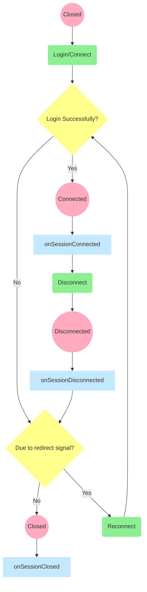

# 客户端接口

Turms客户端目前支持JavaScript、Java与Swift这三种语言，对外暴露一致的接口，并且表现为一致的行为。各语言版本之间的部分接口参数可能出现不完全一致的情况，这主要体现在：1. 接口采用更贴近当前语言特性及习惯的参数与语法；2. turms-client-js独有的用于服务降级配置的参数与接口。

由于Turms各语言客户端行为具有高度的一致性，因此如果您基于上述任意一种语言进行业务开发，您可以在代码逻辑不做改变的情况下，轻松将已写好的业务代码翻译为另外两种语言（具体可参考在本文结尾处的示例）。

（之后还会支持C++，其他语言暂不在考虑范围内）

## Quick Start

1. 克隆Turms仓库（目前客户端代码均未发布到第三方依赖仓库中）。参考命令：git clone --depth 1 https://github.com/turms-im/turms.git
2. 在您的项目中，引入对应的客户端文件
3. 编写业务逻辑

## 版本要求

Turms客户端对版本的最低要求，主要是根据：平台全球市场占有率、平台TLSv1.2最低支持版本与代码实现的优雅程度，三个因素来考量。另外，Turms不提供对TLSv1与TLSv1.1等被时代淘汰协议的官方支持。

* Android平台：支持16+。turms-client-kotlin采用SSLContext实现TLS，其在Android API 16+提供了对TLSv1.2的支持（参考资料[SSLContext](https://developer.android.com/reference/javax/net/ssl/SSLContext)）
* iOS设备：支持12.0+。考虑到[iOS 12.0+在全球的市场占有率](https://developer.apple.com/support/app-store/)以及苹果产品用户的习惯，turms-client-swift采用NWConnection实现TCP协议，因此设备版本的要求等同于支持NWConnection设备的版本要求。另外，turms-client-swift不会考虑用古老的CFStreamCreatePairWithSocketToHost来实现TCP协议。
* 浏览器环境：[支持WebSocket协议的浏览器](https://caniuse.com/?search=websocket)均支持。另外，对于IE系列浏览器，turms-client-js仅对IE 11提供官方支持。
* 桌面端：如果您采用turms-client-kotlin实现，则要求JDK版本为8(+)，因为JDK 8+默认提供对TLSv1.2的支持。如果您采用turms-client-js实现，则Turms提供对Node.js 8+的官方支持。另外，Turms之后还会提供C++实现的turms-client-cpp客户端。

TODO：Turms客户端为快速迭代，目前均采用WebSocket协议。但近期会将turms-client-kotlin/swift的WebSocket协议替换成纯TCP协议实现。此变动不会影响上述的版本要求。

## 客户端的对外逻辑结构

- TurmsClient：Turms客户端唯一直接对外暴露的类，一个TurmsClient实例代表着一个客户端与服务端之间的会话连接。以下变量是TurmsClient对外的成员变量。
  - driver：TurmsClient的运行驱动。负责连接的开起关闭、底层数据的发送接收与心跳控制等基础性操作。以下介绍到的Service层类都基于driver运作。
  
  - userService：用户相关服务。负责如用户登陆、添加好友、添加关系人分组、发送/处理好友请求、查询附近的用户等操作。
  
  - groupService：群组相关服务。负责如创建群组、变更群主、修改群成员角色、修改群信息等操作。
  
  - messageService：消息相关服务。负责如发送消息、修改已发送消息、查询各类消息与其状态、撤回消息等操作。
  
  - notificationService：通知相关服务。负责接受与响应业务层面上的通知（即：其他用户向该用户发送好友请求、群组成员上下线等通知）。
    提醒：消息（message）不算做业务层面上的“通知”（notification），因此notificationService不会处理用户消息，用户消息仅由messageService进行处理。而driver中TurmsNotification的“通知”概念指的是网络层面上的Turms服务端给Turms客户端的通知，因此notificationService也不会处理底层的TurmsNotification数据。
    
    补充：关于通知功能的开启与关闭，您可以在turms服务端im.turms.server.common.property.env.service.business.NotificationProperties处，实时地进行修改。
    
  - storageService：存储相关服务（可选拓展）。负责用户头像、群组头像与消息附件的上传与下载操作。补充：该服务为turms的拓展服务，因此若您希望使用该功能，您需要将turms-plugin-minio或您自行实现的存储插件集成到turms服务端当中。

### Service类的返回值

与Turms服务端交互的所有Turms客户端接口都**基于异步模型编写**。turms-client-js使用Promise模型，turms-client-kotlin使用Future模型，而turms-client-swift使用Promise模型（由PromiseKit提供）。

各种Service类可以对Turms所提供的业务模型进行增删改查操作。您需要了解其返回值种类，以开发您自己的业务代码。

#### 对于状态码为2xxx的响应

* 对于增加业务模型的函数，如果该函数的返回值被声明为一个异步模型（如：Promise\<string>），则返回的泛型（如前文的string类型）的值必定不为空，否则会抛出一个状态码为MISSING_DATA的错误（TurmsBusinessError），表明本应该存在的数据点丢失。若出现该错误，则意味着Turms的服务端或客户端自身存在行为不一致的Bug。
* 对于删除与更新业务模型的函数，它们均返回被异步模型包裹的Void类型（如：Promise\<Void>）。
* 对于查找业务模型的函数，如果该类函数返回被异步模型包裹的List类型，则当服务端返回空数据时，该查找操作函数会返回一个空List，而非null或undefined。如果被包裹的类型不是List类型，则当服务端返回空数据时，该查找操作函数会返回一个undefined（JavaScript）或null（Java）或nil（Swift）。特例：answerGroupQuestions方法可以算做查询方法，但其返回数据永不为空。

#### 对于状态非2xxx的响应

对于Service类而言，这类响应均被认作是“错误”状态响应。通过异步模型抛出TurmsBusinessException，并在该错误模型中包括了具体状态码与错误原因。

### 主要接口差异（拓展知识）

通常情况下，您并不需要关心各客户端接口之间的差异，但如果您的团队需要由一名开发者基于多个Turms客户端进行上层的开发工作，或者您需要对照您项目的上层客户端代码实现的异同，您可以了解一下客户端间主要接口的不同。

在早期Turms客户端实现中，各客户端之间的接口参数与数据模型是尽量保持统一的参数配置与含义，如时间表达相关的参数。但这种强行统一的写法不符合目标语言习惯。同时考虑到在大部分情况下，各客户端的上层业务代码通常有专人负责，而非全由一名开发者负责，统一含义意义不大，并且这些差异也符合目标语言习惯，故不进行强制统一。

客户端主要接口的差异如下表：

|              | JavaScript客户端                  | Java客户端                             | Swift客户端              | 实例            |
| ------------ | --------------------------------- | -------------------------------------- | ------------------------ | ------------------------ |
| 时间表达单位 | 一律为毫秒                        | 一律为毫秒 | 采用TimeInterval（即秒） | connectTimeout |
| 业务异常模型 | TurmsBusinessError（继承自Error） | TurmsBusinessException（继承自不携带栈信息的RuntimeException） | TurmsBusinessError（继承自Error） |    |
| 异步模型     | Promise模型                       | Future模型      | 由PromiseKit提供的Promise模型 |                          |

补充：对于对外暴露的回调函数实现，Turms的Swift客户端没有采用Swift常见的delegate代理模式，而是和其他语言客户端一样通过函数传递逃逸闭包。

## 会话的生命周期

客户端的会话生命周期如下图所示：



### 生命周期回调钩子

您可以通过turmsClient.driver.onSessionConnected/onSessionDisconnected/onSessionClosed来监听生命回调钩子

* onSessionConnected：当会话建立时（网络层连接建立时），onSessionConnected将被调用。

  提醒：由于客户端的登录接口driver.connect与userService.login都返回的是异步模型，因此通常您并不需要监听onSessionConnected事件，而是将您的回调函数赋给异步模型onSucccess的回调函数。

* onSessionDisconnected：当会话断开时（网络层连接断开时），onSessionDisconnected将被调用。同时，Turms客户端会确认服务端发来的断开信令中，是否带有重定向指令。如果有，则客户端将根据服务端发来的重定向地址，进行自动重连操作，重连的逻辑跟登录逻辑一致。否则，会话转入Closed状态，onSessionClosed将被调用。

  提醒：onSessionDisconnected被调用时，会话的生命周期并没有结束。

* onSessionClosed：在一个会话中，当最后一次onSessionDisconnected函数被调用之后（即不再进行重连操作），onSessionClosed将被调用。
  关于业务层面的“在线”与“离线”状态判定。

早期Turms客户端的生命周期钩子采用贴近上层业务层的命名方式：onOnline与onOffline。但由于：1. 该概念无法表达上述onSessionClosed的含义；2. 大部分开发者更愿意通过名称来得知具体底层发生的事情；3. 在极端网络环境下“Online”与“Offline”的说法具有一定的误导性。因为当客户端感知到连接的断开时，onOffline将被触发。但对应的服务端不一定能感知到了连接的断开，因此客户端仍有可能处于“Online”状态。因此不再采用这种命名方式。

## 业务逻辑的认证与授权

对于客户端发来的权限信息，Turms服务端的态度是“客户端传来的权限信息均不可信”，因此Turms服务端会根据您在Turms服务端处所设定的业务配置，自行做各种必要的权限判断。

以“修改已发送消息”功能为例，该行为会触发一系列判定逻辑。Turms会先判断目标消息是否确实是由该用户发出的，再根据您在Turms服务端配置的allowEditingMessageBySender（默认为true），来判断是否允许用户修改已发送消息，若您设置其为false，则在客户端处会捕获到一个TurmsBusinessException（Java）或TurmsBusinessError（JavaScript/Swift）对象，而它由业务状态码模型TurmsStatusCode表示（由code与reason描述信息组成）。

再比如对于一个“简单”的“发送消息”请求，Turms服务端就会判断该消息发送用户是否处于激活状态、是否设置了“允许发送消息给陌生人（非关系人）”、消息发送者是否在黑名单中。如果接收方是群组，那么消息发送者是否是群成员，并且是否处于禁言状态等等逻辑判断。而您仅仅只需调用一个sendMessage接口即可。

## 关于turms-client-js的特别说明

由于浏览器自身的限制繁多，因此针对浏览器运行环境，有以下三点需要注意：

1. 由于现代浏览器不允许非服务端环境（如本地文件环境file://）传送cookie数据，而turms-client-js需要通过cookie来传送用户登录信息，因此您必须在HTTP(S)服务端环境执行turms-client-js接口，例如：http://localhost:63342/turms-client-js/demo/demo.html（补充：可通过Intellij Idea来“Run”一个HTML页面，该HTML页面会自动运行在Idea提供的HTTP服务器上），否则turms-client-js将无法执行客户端的登陆操作。
2. 服务降级（由turms引擎实现，您无需自行实现，了解即可）。在现代浏览器中，如果WebSocket在HTTP握手阶段被拒绝Upgrade（对应着登录失败的情况），以及WebSocket已建立的连接被断开（对应着业务会话中断），二者被拒绝或断开的真实状态码与原因都无法通过浏览器接口获得。因此Turms提供了服务降级机制，默认turms-client-js会通过HTTP(S)请求向turms-gateway查询其真实状态码。（具体实现可查阅：im.turms.gateway.accecss.http.controller.ReasonController）
3. turms-client-js不进行类似于socket.io提供的WebSocket服务降级处理操作，因此turms-client-js不会降级为轮询机制。

## 具体示例

以下示例包括turms-client-js/java/swift三个版本，并且其作用等价。具体包括了以下业务操作：初始化客户端、登录、监听会话连接断开（下线）、监听通知、监听新消息、查询附近的用户、发送消息、创建群组操作。

### 体验实例的准备工作

* 方案一：在application.yaml配置文件中更新以下配置：
   1. 将“turms.gateway.session.enable-authentication”设置为false（取消用户登录认证）
   2. 将“turms.service.message.allow-sending-messages-to-stranger”也设置为true（允许没有用户关系的用户互相发送消息）
* 方案二：使用自带“dev” profile配置。因为Turms提供的“dev” profile已做了上述配置。默认情况下，Turms发布包中的application.yaml的profile字段为空，即默认的profile不是“dev”，需要您手动配置为“dev”。

提醒：以下客户端API为最新版本示例，而目前Playground上的Turms服务端（ http://120.24.57.206:9510 ）为老版本，因此如果您直接连接Playground的服务端，可以会出现数据不一致的问题。

### turms-client-js版本

```javascript
// Initialize client
const client = new TurmsClient(); // new TurmsClient('ws://any-turms-gateway-server.com');

// Listen to the disconnect event
client.driver.onSessionDisconnected = (info) => {
    console.info(`onSessionDisconnected: ${info.closeStatus}:${info.webSocketStatusCode}:${info.webSocketReason}:${info.error}`);
};

// Listen to inbound notifications
client.notificationService.onNotification = (notification) => {
    console.info(`onNotification: Receive a notification from other users or server: ${JSON.stringify(notification)}`);
};

// Listen to inbound messages
client.messageService.onMessage = (message) => {
    console.info(`onMessage: Receive a message from other users or server: ${JSON.stringify(message)}`);
};

client.userService.login('1', '123')
    .then(() => {
    	client.userService.queryUserIdsNearby(
            139.667651,
            35.792657,
        	100,
        	10)
        	.then(ids => {
        		console.log(`user ids: ${ids}`);
    		});
    	client.messageService.sendMessage(
        	false,
        	1,
        	new Date(),
        	'Hello Turms',
        	null,
        	30)
        	.then(id => {
            	console.log(`message ${id} has been sent`);
        	});
    	client.groupService.createGroup(
            'Turms Developers Group',
            'This is a group for the developers who are interested in Turms',
            'nope')
            .then(id => {
            	console.log(`group ${id} has been created`);
        	});
	})
    .catch(reason => {
    	console.error(reason);
	});
```

### turms-client-kotlin版本

```java
// Initialize client
TurmsClient client = new TurmsClient(); // new TurmsClient("ws://any-turms-gateway-server.com");

// Listen to the disconnect event
client.getDriver().onSessionDisconnected(info -> {
    SessionCloseStatus closeStatus = info.getCloseStatus();
    Throwable error = info.getError();
    System.out.printf("onSessionDisconnected: %d:%d:%s:%s%n",
            closeStatus != null ? closeStatus.getCode() : null,
            info.getWebSocketStatus(),
            info.getWebSocketReason(),
            error != null ? error.getMessage() : null);
});

// Listen to inbound notifications
client.getNotificationService().setOnNotification(notification -> {
    System.out.printf("onNotification: Receive a notification from other users or server: %s%n",
            notification.toString());
});

// Listen to inbound messages
client.getMessageService().setOnMessage((message, messageAddition) -> {
    System.out.printf("onMessage: Receive a message from other users or server: %s%n",
            message.toString());
});

client.getUserService().login(1, "123")
        .thenAccept(ignored -> {
            client.getUserService().queryUserIdsNearby(
                    139.667651f,
                    35.792657f,
                    100,
                    10)
                    .thenAccept(ids -> System.out.printf("user ids: %s%n", ids.toString()));
            client.getMessageService().sendMessage(
                    false,
                    1,
                    new Date(),
                    "Hello Turms",
                    null,
                    30)
                    .thenAccept(id -> System.out.printf("message %d has been sent%n", id));
            client.getGroupService().createGroup(
                    "Turms Developers Group",
                    "This is a group for the developers who are interested in Turms",
                    "nope",
                    null,
                    null,
                    null)
                    .thenAccept(id -> System.out.printf("group %d has been created%n", id));
        })
        .exceptionally(throwable -> {
            throwable.printStackTrace();
            return null;
        });
```

### turms-client-swift版本

```swift
// Initialize client
let client = TurmsClient() // TurmsClient("ws://any-turms-gateway-server.com")

// Listen to the disconnect event
client.driver.onSessionDisconnected = { (info: SessionDisconnectInfo) -> () in
    var closeStatusStr = ""
    if let status = info.closeStatus {
        closeStatusStr = String(status.rawValue)
    }
    var statusCodeStr = ""
    if let code = info.webSocketStatusCode {
        statusCodeStr = String(code)
    }
    print("onSessionDisconnected: \(closeStatusStr):\(statusCodeStr):\(info.webSocketReason ??
""):\(info.error?.localizedDescription ?? "")")
}

// Listen to inbound notifications
client.notificationService.onNotification = { (notification: TurmsRequest) -> Void in
    print("onNotification: Receive a notification from other users or server: \(try! notification.jsonString())")
}

// Listen to inbound messages
client.messageService.onMessage = { (message: Message, _: MessageAddition) -> Void in
    print("onMessage: Receive a message from other users or server: \(try! message.jsonString())")
}

client.userService.login(userId: 1, password: "123")
    .done {
        client.userService.queryUserIdsNearby(
            latitude: 139.667651,
            longitude: 35.792657,
            distance: 100,
            maxNumber: 10)
            .done {
                print("user ids: \($0)")
            }
        client.messageService.sendMessage(
            isGroupMessage: false,
            toId: 1,
            deliveryDate: Date(),
            text: "Hello Turms",
            records: nil,
            burnAfter: 30)
            .done {
                print("message \($0) has been sent")
            }
        client.groupService.createGroup(
            name: "Turms Developers Group",
            intro: "This is a group for the developers who are interested in Turms",
            announcement: "nope")
            .done {
                print("group \($0) has been created")
            }
    }.catch {
        print($0)
    }
```
