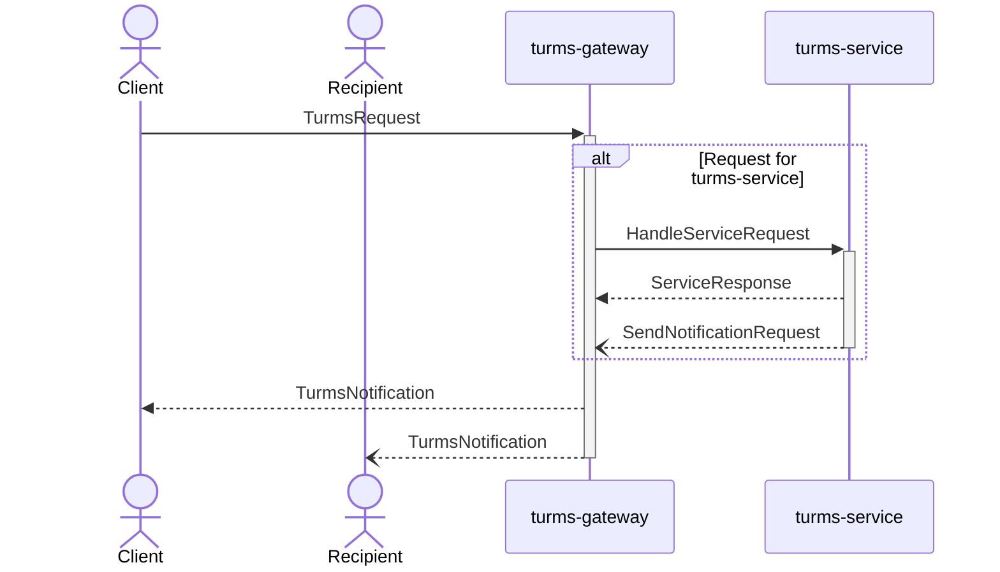
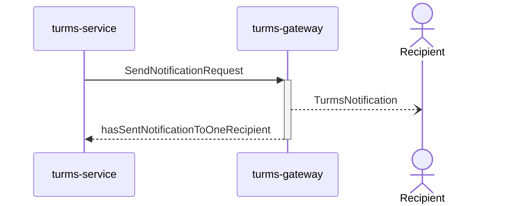
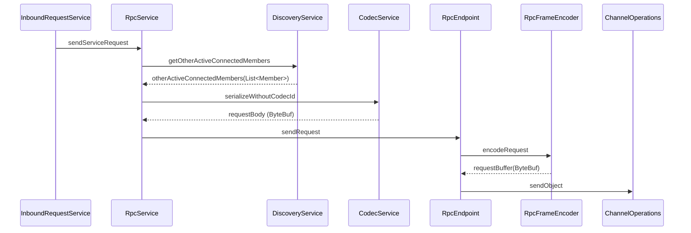

# 源码

本文讲解服务端各主要功能模块的大致源码实现，以帮忙开发者更好地理解相关流程。

注意事项：

1. Turms服务端重度使用[reactor-core](https://projectreactor.io/docs/core/release/reference)这一响应式框架，本文默认读者已经熟练掌握响应式编程，如果读者还没掌握响应式编程，则建议先自行学习并掌握[reactor-core](https://projectreactor.io/docs/core/release/reference)。
2. Turms会不定期优化代码，因此一些函数名或函数实现可能会稍微改变，但其思想是不会变的。
3. 各模块源码所做的事情通常比下文讲得多得多，但为了方便读者理解，**本文只挑选主要流程进行讲解，并略去了大量细节**。如果读者对其中的细节感兴趣，可以在阅读完本文的相关讲解，并对主要流程有大概的认识后，再去阅读源码，了解其具体实现细节。

## 客户端请求处理流程

阅读下文前，建议读者先行阅读[客户端访问服务端标准流程](https://turms-im.github.io/docs/for-developers/architecture.html#%E5%AE%A2%E6%88%B7%E7%AB%AF%E8%AE%BF%E9%97%AE%E6%9C%8D%E5%8A%A1%E7%AB%AF%E6%A0%87%E5%87%86%E6%B5%81%E7%A8%8B)，先从架构角度理解其背后的设计思路，这样在读源码的时候就不容易“迷路”。

请求模型：`im.turms.common.model.dto.request.TurmsRequest`

响应与通知模型：`im.turms.common.model.dto.notification.TurmsNotification`

### UML顺序图



### turms-gateway

简介：用于维护与客户端的网络连接，维护应用层会话，并将大部分的业务请求下发给turms-service服务端。

#### 网络层配置

1. 启动接收客户端请求的服务端

   TCP服务端：`im.turms.gateway.access.tcp.factory.TcpServerFactory#create`

   WebSocket服务端：`im.turms.gateway.access.websocket.factory.WebSocketFactory#create`

   这两个函数主要做的就是：基于reactor-netty，绑定监听地址、配置EventLoop线程池、（可选）配置SSL、开启相关度量等常规工作。

2. 对于纯TCP连接（而非预备的WebSocket连接），给新确立的TCP连接绑上编解码Handlers

   在`im.turms.gateway.access.tcp.factory.TcpServerFactory#create`函数内，通过下述回调，给新TCP连接绑上对应的`TurmsRequest`与`TurmsNotification`的编解码实例。

   ```java
   .doOnConnection(handlerConfig::configureConnection);
   ```

   其中，`configureConnection`函数来自：`im.turms.gateway.access.tcp.handler.TcpHandlerConfig`

   ```java
   void configureConnection(Connection connection) {
       connection.addHandlerLast("varintLengthBasedFrameDecoder", CodecFactory.getExtendedVarintLengthBasedFrameDecoder(maxFrameLength));
       connection.addHandlerLast("varintLengthFieldPrepender", CodecFactory.getVarintLengthFieldPrepender());
       connection.addHandlerLast("protobufFrameEncoder", CodecFactory.getProtobufFrameEncoder());
   }
   ```

3. 对于WebSocket连接，则先监听并校验HTTP Upgrade请求，然后再Upgrade成WebSocket连接

   在`im.turms.gateway.access.websocket.factory.WebSocketFactory#create`函数内，通过下述代码绑定HTTP监听回调：

   ```
   .handle(getHttpRequestHandler(handler, serverSpec))
   ```

   其中`getHttpRequestHandler`函数来自`im.turms.gateway.access.websocket.factory.WebSocketFactory#getHttpRequestHandler`，该回调用于校验HTTP请求，如果监听到是合法的HTTP Upgrade请求，则将该连接升级为WebSocket连接。

至此，纯网络层的操作基本就完成了，下一步就是衔接网络层与业务逻辑层。

#### 网络层与业务逻辑层的衔接

1. 网络层与业务逻辑层，通过函数接口：`im.turms.gateway.access.common.function.ConnectionHandler#handle`进行绑定，主要绑定的内容就是：输入字节流、输出字节流、连接关闭时的回调函数。

   对于TCP服务端，在`im.turms.gateway.access.tcp.factory.TcpServerFactory#create`函数下，通过`.handle((in, out) -> handler.handle((Connection) in, false, in.receive(), out, ((Connection) in).onDispose()))`进行绑定。

   对于WebSocket服务端，在`im.turms.gateway.access.websocket.factory.WebSocketFactory#create`函数下，通过`handler.handle((Connection) in, true, inbound, out, onClose)`绑定。

2. 上述`handler.handle`会调用下述的`im.turms.gateway.access.common.UserSessionDispatcher#bindConnectionWithSessionWrapper`回调函数，用于协调处理输入字节流与输出字节流的逻辑，而从全局视角来看，这些字节数据本质上就是上层业务层的`请求`、`响应`与`通知`，因此这部分代码是服务端与客户端交互的重点，我们之后还会回看这块代码。其源码如下：

   ```java
   ConnectionHandler bindConnectionWithSessionWrapper() {
       return (connection, isWebSocketConnection, in, out, onClose) -> {
           InetSocketAddress address = (InetSocketAddress) connection.address();
           NetConnection netConnection = NetConnection.create(connection);
           UserSessionWrapper sessionWrapper = new UserSessionWrapper(netConnection, address, closeIdleConnectionAfterSeconds,
                   userSession -> userSession.setNotificationConsumer((turmsNotificationBuffer, tracingContext) -> {
                       turmsNotificationBuffer.touch(turmsNotificationBuffer);
                       NettyOutbound outbound = isWebSocketConnection
                               ? out.sendObject(new BinaryWebSocketFrame(turmsNotificationBuffer))
                               : out.sendObject(turmsNotificationBuffer);
                       Mono.from(outbound)
                               .subscribe(null, t -> handleConnectionError(t, netConnection, userSession, tracingContext));
                   }));
           respondToRequests(connection, isWebSocketConnection, in, out, sessionWrapper);
           return tryRemoveSessionInfoOnConnectionClosed(onClose, sessionWrapper);
       };
   }
   ```

   其中，`userSession.setNotificationConsumer`用于设置监听`通知`的回调函数，该回调函数会将接收到的`通知`字节数据，发送给客户端。这个回调函数也是重点，因为我们之后讲到的turms-service给turms-gateway发送`通知`的流程，其最终会回到这里。

   而`respondToRequests`函数则用于监听`请求`输入字节流，并对返回对应的`响应`输出字节流，该函数源码如下：

   ```java
   void respondToRequests(Connection connection,
                          boolean isWebSocketConnection,
                          Flux<ByteBuf> in,
                          NettyOutbound out,
                          UserSessionWrapper sessionWrapper) {
       in
               .doOnNext(requestData -> {
                   if (connection.isDisposed()) {
                       return;
                   }
                   requestData.retain();
                   TracingContext ctx = new TracingContext();
                   clientRequestDispatcher.handleRequest(sessionWrapper, requestData)
                           .onErrorResume(throwable -> {
                               ctx.updateThreadContext();
                               handleNotificationError(throwable, sessionWrapper.getUserSession());
                               return Mono.empty();
                           })
                           .flatMap(turmsNotificationBuffer -> {
                               NettyOutbound outbound = isWebSocketConnection
                                       ? out.sendObject(new BinaryWebSocketFrame(turmsNotificationBuffer))
                                       : out.sendObject(turmsNotificationBuffer);
                               return Mono.from(outbound);
                           })
                           .contextWrite(context -> context.put(TracingContext.CTX_KEY_NAME, ctx))
                           .doFinally(signal -> ctx.clearThreadContext())
                           .subscribe(null, t -> handleConnectionError(t, sessionWrapper.getConnection(),
                                   sessionWrapper.getUserSession(), ctx));
               })
               .then()
               .subscribe(null, t -> handleConnectionError(t, sessionWrapper.getConnection(),
                       sessionWrapper.getUserSession(), TracingContext.NOOP));
   }
   ```

   其中，`respondToRequests`在`clientRequestDispatcher.handleRequest(sessionWrapper, requestData)`处，将`请求`的字节流`ByteBuf`，递交给下游的业务逻辑层进行处理；在`.flatMap(turmsNotificationBuffer -> {`回调处，将请求的`响应`字节流进行输出。

   至此，网络层的数据已经传达到了下游业务层，网络层`接收请求`的工作结束了，接下来就都是业务层相关操作。

   注意：虽然网络层`接收请求`的工作结束了，但网络层之后还要处理下游业务逻辑层发回的`响应`与`通知`字节数据，而这收尾的代码，上文已经提及，就不赘述了。

#### 业务层——请求调度层

经由网络层的操作，来到了`im.turms.gateway.access.common.ClientRequestDispatcher#handleRequest`。该函数完成：调度心跳请求、业务请求；简单校验请求，如果是非法请求，则尝试拉黑等。

该函数的代码虽多，但其实很容易读，我们这里主要关注的是`handleServiceRequest(sessionWrapper, request, serviceRequestBuffer, tracingContext)`这行代码，`handleServiceRequest`函数的主要源码如下：

```java
return switch (requestType) {
    case CREATE_SESSION_REQUEST -> sessionController
            .handleCreateSessionRequest(sessionWrapper, request.createSessionRequest())
            .map(result -> getNotificationFromHandlerResult(result, request.requestId()));
    case DELETE_SESSION_REQUEST -> sessionController.handleDeleteSessionRequest(sessionWrapper);
    default -> {
        serviceRequestBuffer.retain();
        yield handleServiceRequestForTurms(sessionWrapper, request, serviceRequestBuffer);
    }
};
```

* 将`CREATE_SESSION_REQUEST`与`DELETE_SESSION_REQUEST`这两个turms-gateway能自行处理的请求交由自己的Controller层进行处理，即`im.turms.gateway.access.common.controller.SessionController`，该Controller主要就是借由`im.turms.gateway.service.impl.session.SessionService`服务与Redis服务端进行交互，执行用户`登陆`与`登出`相关逻辑。由于业务逻辑并非本篇的重点，这里就不展开讲了。等这Controller与Service的逻辑都处理完，则返回一个`TurmsNotification`对象，并经由上述的网络层与编解码Handlers，最终将字节数据发送给客户端。

* 对于其他所有请求，turms-gateway通过上述的`handleServiceRequestForTurms`函数，最终经由RPC，将客户端请求下发给turms-service进行处理。其中的大致调用流程如下：经过几层简单的调用，来到`im.turms.gateway.service.impl.message.InboundRequestService#processServiceRequest0`，该函数会调用`im.turms.gateway.service.impl.message.InboundRequestService#sendServiceRequest`通过自研RPC框架，将包装有客户端请求字节数据的RPC请求`im.turms.server.common.rpc.request.HandleServiceRequest`下发给turms-service进行处理。其中，具体RPC的实现并非本篇重点，这里就不展开讲了。等turms-service处理完请求，会返回一个`im.turms.server.common.dto.ServiceResponse`，该对象会在上述的`im.turms.gateway.service.impl.message.InboundRequestService#processServiceRequest0`函数的代码，经过下述的`getNotificationFromResponse`函数将`ServiceResponse`转换为`TurmsNotification`，并经由上述的网络层与编解码Handlers，最终将字节数据发送给客户端。：

  ```java
  return sendServiceRequest(serviceRequest)
          .defaultIfEmpty(REQUEST_RESPONSE_NO_CONTENT)
          .map(response -> getNotificationFromResponse(response, serviceRequest.getRequestId()));
  ```

至此，turms-gateway的客户端请求的处理逻辑就讲解完了，下文接着讲解turms-service是如何处理上游turms-gateway发来的RPC请求的。

### turms-service

（RPC实现属于“集群服务”实现内容，这里不做相关讲解）

1. 请求调度层

   经由RPC层的处理，turms-service会首先通过`im.turms.service.workflow.access.servicerequest.dispatcher.ServiceRequestDispatcher#dispatch`拿到客户端请求的字节数据。该函数会调用`im.turms.service.workflow.access.servicerequest.dispatcher.ServiceRequestDispatcher#dispatch0`函数，完成诸如：请求校验、客户端拉黑、判断服务端监控状态、触发插件与调用Controller层接口函数、触发上游等任务。代码虽多，但其实还是比较易读的，这里我们主要看到其中的`result = handler.handle(lastClientRequest);`这行代码，`handler#handle`函数其实是`im.turms.service.workflow.access.servicerequest.dispatcher.ClientRequestHandler#handle`函数，而`handle`函数的实现，其实就是各Controller层接口的实现。

2. 请求Controller层

   各Controller通过上述的`handle`函数，拿到了传来的`im.turms.service.workflow.access.servicerequest.dto.ClientRequest`对象后，就开始执行相关的业务逻辑，并向MongoDB服务端发送各种CRUD请求。业务逻辑处理并非本篇重点，这里就不展开讲解了。等Controller层处理完相关业务逻辑，就会返回一个`im.turms.service.workflow.access.servicerequest.dto.RequestHandlerResult`对象。简单来说，该对象描述了：要发回给客户端的`响应`，与要发给其他用户的`通知`（如发送群聊消息，对于消息的接收客户端，这些发送给它们的输出字节流就是`通知`）。

   对于`响应`，会借由上述的RPC操作，将字节数据发回给turms-gateway，而turms-gateway再通过上述已经提及过的`respondToRequests`函数里的`.flatMap(turmsNotificationBuffer -> {`，最终将响应字节数据发送给客户端。

至此，一个请求就被处理完了。

## 通知下发

通知模型：`im.turms.common.model.dto.notification.TurmsNotification`

`通知`有且仅会被turms-service生成，turms-gateway不会自行生成`通知`。

### UML顺序图



### turms-service

在上文中，我们讲到turms-service在处理完客户端请求的业务逻辑后，会返回一个`im.turms.service.workflow.access.servicerequest.dto.RequestHandlerResult`对象，该对象也包含了：通知数据与一组需要接收通知的用户ID。该对象会被先传递到`im.turms.service.workflow.access.servicerequest.dispatcher.ServiceRequestDispatcher#dispatch0`函数里的下述回调中：

```java
.doOnEach(signal -> {
    if (!signal.isOnNext()) {
        return;
    }
    RequestHandlerResult requestResult = signal.get();
    if (requestResult == null || requestResult.code() != TurmsStatusCode.OK) {
        return;
    }
    notifyRelatedUsersOfAction(requestResult, userId, deviceType)
            .contextWrite(signal.getContextView())
            .subscribe(null, t -> {
                try (TracingCloseableContext ignored = context.asCloseable()) {
                    LOGGER.error("Failed to notify related users of the action", t);
                }
            });
})
```

其中，`notifyRelatedUsersOfAction`函数会异步发送`通知`给相关用户，其代码实现如下：

```java
Mono<Void> notifyRelatedUsersOfAction(
        RequestHandlerResult result,
        Long requesterId,
        DeviceType requesterDevice) {
    TurmsRequest dataForRecipients = result.dataForRecipients();
    Set<Long> recipients = result.recipients();
    if (dataForRecipients == null || recipients.isEmpty()) {
        return Mono.empty();
    }
    TurmsNotification notificationForRecipients = TurmsNotification
            .newBuilder()
            .setRelayedRequest(dataForRecipients)
            .setRequesterId(requesterId)
            .build();
    ByteBuf notificationByteBuf = ProtoUtil.getDirectByteBuffer(notificationForRecipients);
    if (result.forwardDataForRecipientsToOtherSenderOnlineDevices()) {
        notificationByteBuf.retain(2);
        Mono<Boolean> notifyRequesterMono = outboundMessageService
                .forwardNotification(notificationForRecipients, notificationByteBuf, requesterId, requesterDevice);
        Mono<Boolean> notifyRecipientsMono = outboundMessageService
                .forwardNotification(notificationForRecipients, notificationByteBuf, recipients);
        return Mono.when(notifyRequesterMono, notifyRecipientsMono)
                .doFinally(signal -> notificationByteBuf.release());
    }
    return outboundMessageService.forwardNotification(notificationForRecipients, notificationByteBuf, recipients)
            .then();
}
```

我们主要看`outboundMessageService.forwardNotification`函数，该函数首先会通过`im.turms.server.common.service.session.UserStatusService#getDeviceAndNodeIdMapByUserId`函数从本地缓存或者Redis服务端中拉取通知接收用户ID所在的turms-gateway服务端节点ID，拿到这些节点ID后，再通过`im.turms.service.workflow.service.impl.message.OutboundMessageService#forwardClientMessageToNodes`函数，将`通知`通过RPC实现，转发给这些节点，让其进行具体的通知下发操作。具体代码实现如下：

```java
Mono<Boolean> forwardNotification(
        TurmsNotification notificationForLogging,
        ByteBuf notificationData,
        Long recipientId,
        DeviceType excludedDeviceType) {
    return userStatusService.getDeviceAndNodeIdMapByUserId(recipientId)
            .doOnError(t -> notificationData.release())
            .flatMap(deviceTypeAndNodeIdMap -> {
                Set<String> nodeIds = CollectionUtil.newSetWithExpectedSize(deviceTypeAndNodeIdMap.size());
                for (Map.Entry<DeviceType, String> entry : deviceTypeAndNodeIdMap.entrySet()) {
                    DeviceType deviceType = entry.getKey();
                    if (deviceType != excludedDeviceType) {
                        nodeIds.add(entry.getValue());
                    }
                }
                if (nodeIds.isEmpty()) {
                    notificationData.release();
                    return Mono.just(false);
                }
                Mono<Boolean> mono = forwardClientMessageToNodes(notificationData, nodeIds, recipientId);
                return tryLogNotification(mono, notificationForLogging, 1);
            })
            .switchIfEmpty(Mono.fromCallable(() -> {
                notificationData.release();
                return false;
            }));
}
```

### turms-gateway

`通知`经过RPC的转发后，turms-gateway首先会在`im.turms.gateway.service.impl.message.OutboundMessageService#sendNotificationToLocalClients`函数中获得turms-service发来的`通知`字节数据。该函数会调用`userSession.sendNotification(wrappedNotificationData, tracingContext)`将通知数据发送给该批用户的会话。而`sendNotification`函数就是之前我们让读者重点注意的，在`im.turms.gateway.access.common.UserSessionDispatcher#bindConnectionWithSessionWrapper`的回调函数，该函数通过`out.sendObject`完成通知的字节数据下发。具体代码如下：

```java
UserSessionWrapper sessionWrapper = new UserSessionWrapper(netConnection, address, closeIdleConnectionAfterSeconds,
        userSession -> userSession.setNotificationConsumer((turmsNotificationBuffer, tracingContext) -> {
            turmsNotificationBuffer.touch(turmsNotificationBuffer);
            NettyOutbound outbound = isWebSocketConnection
                    ? out.sendObject(new BinaryWebSocketFrame(turmsNotificationBuffer))
                    : out.sendObject(turmsNotificationBuffer);
            Mono.from(outbound)
                    .subscribe(null, t -> handleConnectionError(t, netConnection, userSession, tracingContext));
        }));
```

至此，`通知`发送完毕。

## 集群实现

在阅读下述源码前，建议读者先阅读[集群的设计与实现](https://turms-im.github.io/docs/for-developers/cluster.html)，理解集群服务的基本设计与职责。

### 服务注册与发现

TODO

### 网络连接服务

TODO

### RPC

本文将继续以在上文`客户端请求处理流程`提到的RPC请求示例进行讲解，即：turms-gateway向turms-service发送`HandleServiceRequest`这一RPC请求。

#### HandleServiceRequest的RPC发送端

##### UML顺序图



##### 业务层

接着上文，turms-gateway会通过`im.turms.gateway.service.impl.message.InboundRequestService#sendServiceRequest`函数向turms-service发送`HandleServiceRequest`，而该函数会调用RPC服务的`im.turms.server.common.cluster.service.rpc.RpcService#requestResponse`函数，将RPC请求的处理逻辑代理给下游RPC服务执行，具体代码如下：

```java
Mono<ServiceResponse> sendServiceRequest(ServiceRequest serviceRequest) {
    HandleServiceRequest request = new HandleServiceRequest(serviceRequest);
    return node.getRpcService().requestResponse(request);
}
```

##### RPC层——逻辑层

由于函数调用方并没有指定`HandleServiceRequest`请求的RPC接收节点，因此`requestResponse`函数会首先通过`im.turms.server.common.cluster.service.rpc.RpcService#getOtherActiveConnectedMembersToRespond`函数，获得一批可以处理该RPC请求的节点，在判断完这些节点的健康状态后，如果不存在健康的节点，则抛异常，否则再将这RPC请求通过`im.turms.server.common.cluster.service.codec.CodecService#serializeWithoutCodecId`编码成字节数据，并通过`endpoint.sendRequest(request, requestBody)`这一函数，将字节数据交由下游的网络层进行发送。`requestResponse0`的具体源码如下：

```java
<T> Mono<T> requestResponse0(RpcEndpoint endpoint,
                             RpcRequest<T> request,
                             @Nullable Duration timeout) {
    try {
        assertCurrentNodeIsAllowedToSend(request);
    } catch (Exception e) {
        request.release();
        return Mono.error(e);
    }
    if (timeout == null) {
        timeout = defaultRequestTimeoutDuration;
    }
    Mono<T> mono = Mono
            .deferContextual(context -> {
                addTraceIdToRequestFromContext(context, request);
                ByteBuf requestBody;
                try {
                    requestBody = codecService.serializeWithoutCodecId(request);
                } catch (Exception e) {
                    request.release();
                    return Mono.error(new IllegalStateException("Failed to encode the
                }
                return endpoint.sendRequest(request, requestBody);
            })
            .timeout(timeout)
            .name(METRICS_NAME_RPC_REQUEST)
            .tag(METRICS_TAG_REQUEST_NAME, request.name())
            .tag(METRICS_TAG_REQUEST_TARGET_NODE_ID, endpoint.getNodeId());
    Tag tag = request.tag();
    if (tag != null) {
        mono = mono.tag(tag.getKey(), tag.getValue());
    }
    return mono
            .metrics()
            .onErrorMap(t -> mapThrowable(t, request));
}
```

##### RPC层——网络层

RPC请求在被上游RPC逻辑层编码成字节数据后，会被传递给`im.turms.server.common.cluster.service.rpc.RpcEndpoint#sendRequest`函数，该函数会通过`RpcFrameEncoder.INSTANCE.encodeRequest(request, requestBody)`再给该字节数据append上`请求类型ID`与`请求ID`这两个字节数据，以让RPC对端能够根据`请求类型ID`进行解码，并通过`请求ID`返回对应的响应，并最终发送字节流数据给RPC对端。`sendRequest`具体代码实现如下：

```java
<T> Mono<T> sendRequest(RpcRequest<T> request, ByteBuf requestBody) {
    ChannelOperations<?, ?> conn = connection.getConnection();
    if (requestBody.refCnt() == 0) {
        return Mono.error(new IllegalReferenceCountException("The request body has been released"));
    }
    if (conn.isDisposed()) {
        requestBody.release();
        return Mono.error(new ClosedChannelException());
    }
    Sinks.One<T> sink = Sinks.one();
    while (true) {
        int requestId = generateRandomId();
        Sinks.One<?> previous = pendingRequestMap.putIfAbsent(requestId, sink);
        if (previous != null) {
            continue;
        }
        request.setRequestId(requestId);
        ByteBuf buffer;
        try {
            buffer = RpcFrameEncoder.INSTANCE.encodeRequest(request, requestBody);
        } catch (Exception e) {
            requestBody.release();
            resolveRequest(requestId, null, new IllegalStateException("Failed to encode request", e));
            break;
        }
        conn.sendObject(buffer)
                .then()
                .subscribe(null, t -> resolveRequest(requestId, null, t));
        break;
    }
    return sink.asMono();
}
```

至此，RPC发送端的处理流程就结束了。

特别一提的是：之所以`请求ID`没有在上游就被编码，这是因为部分RPC请求有可能被发送给多个RPC接收端，如群消息就经常被转发给多个turms-gateway服务端，而通过分别编码，就可以让上游传来的字节数据被共享，无需内存拷贝，极大地提升内存使用率，这也是为什么Turms要自研RPC服务的原因之一。

##### HandleServiceRequest的RPC接收端

TODO
