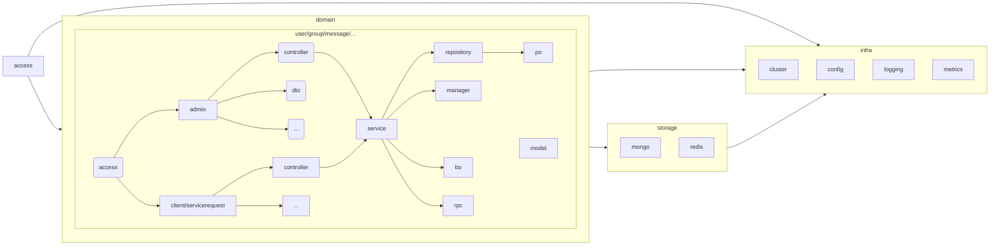
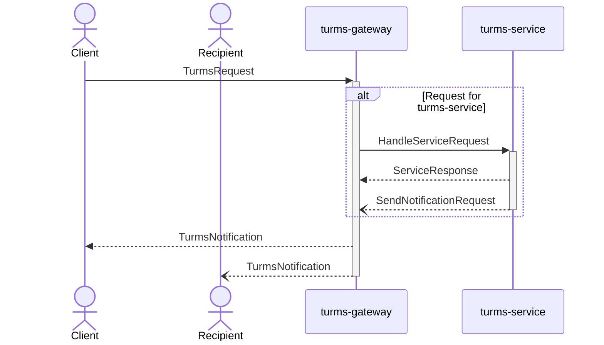
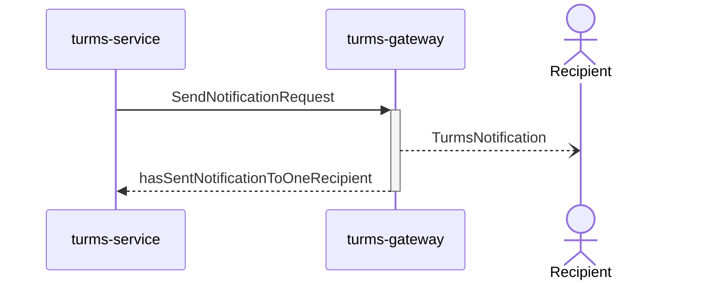
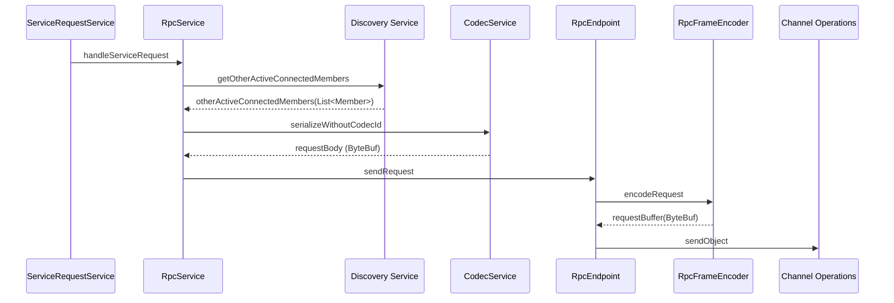

# Source Code

This article explains the package structure of the Turms server and the approximate source code implementation of each main functional module to help developers read the source code and understand the related process faster.

remind:

1. The Turms server heavily uses the responsive framework of [reactor-core](https://projectreactor.io/docs/core/release/reference). This article assumes that the reader has mastered responsive programming. If the reader has not mastered For responsive programming, it is recommended to learn and master [reactor-core](https://projectreactor.io/docs/core/release/reference) by yourself.
2. Turms will optimize the code from time to time. Some function names or function implementations may change slightly, but the idea will not change.
3. What the source code of each module does is usually much more than what is described below, but for the convenience of readers to understand, **this article only selects the main process to explain, and omits a lot of details**. If readers are interested in the details, they can read the source code after reading the relevant explanations in this article and have a general understanding of the main process to understand its specific implementation details.

## Project Structure

We often say that code is a document. Code allows readers to understand the implementation details and logical relationship of each function from a micro perspective, while a package is like a directory of documents. A good subcontract should clearly show the hierarchy and structure of the "document" at a macro level, so that readers can understand it. This article explains the package structure of the Turms server to help developers better understand the relationship and hierarchy between packages.

### Background (extended content)

No matter what kind of subcontracting concept, in fact, there are only four basic subcontracting categories: by feature (Feature), by type (Type), by layer (Layer) and no subcontracting, and various upper-level designs Ideas are simply different combinations of these basic subcontracting categories.

In addition, even for the same project, different package structures are usually applicable at different development stages. We often say that the architecture is an evolutionary development, and the package classification actually needs an evolutionary development. For example, in the early stage of the Turms server, there were not many modules in total, but according to the idea of subcontracting a bunch of modules by the Turms server today, we designed the package structure for the early Turms server, and the result is: the readability of the package structure Not rising but falling, designing for the sake of design, that is, over-designing.

### Subcontract target (expanded content)

When doing subcontract design, you must have a clear goal, otherwise it is easy to fall into the situation of "forcibly subcontracting in order to cover a certain package design", such as the service layer of some projects, first write the interface class and then write the implementation class, without thinking Why do we need such an interface in the design specification, or forcibly apply the DDD layered template, without thinking about whether some designs have seriously violated the established conventions, which leads to handicap when programming.

The main objectives of the subcontracting of the Turms server project are:

* Try to ensure high cohesion of functional feature modules and reduce the complexity of modules. This is mainly for the maintainability of the code to avoid falling into the very common `mixed design by feature+by type` or `mixed design by feature+by type+by layer`, because the hybrid design will both It makes the ownership of the code ambiguous, and also reduces the readability of the package structure due to the use of different subcontracting strategies under one layer of packages, which is not conducive to long-term maintenance.
* Try to ensure the independence of the business sub-domain. This is mainly to draw clear business boundaries and make each module easy to read and change (additionally, turms-service will support deployment in various business domain combinations in the future, for example, turms-service can be deployed in the future It can also be deployed as a service in the user business domain, or as a service in the message business domain, or as a service in the user + message business domain, etc.).
* The functional feature modules and business modules of the supporting domain must be separated. This is mainly to draw a clear boundary between the problem domain and the support domain.
* Try to let developers guess the upstream and downstream relationship of the package through the package structure. This is mainly due to the readability of the code. In long-term programming practice, when we see that the package structure of medium and large projects does not have layered code, then we may have to go through the package or code several times before Infer possible upstream and downstream relationships of packages.
* In the case of clear logic, try to make the package level less.

In addition, when reading the package structure of various excellent open source projects, we will find that most of the well-known medium and large open source server projects may not do hierarchical design at all, and usually focus on subpackaging according to functional characteristics, with Subcontracting by type is supplemented by hybrid design, or by conventional MVC or DDD layered design. For these subcontracting ideas, we generally evaluate "moderate, in line with conventions, but unsatisfactory", because they do not well meet the above-mentioned `subcontracting goals`, and many developers will also fall into the trap when reading the source code of these projects. In the case of "don't know where to start", coding often encounters the problem of ambiguous attribution of code.

### subcontracting idea

Various subcontracting concepts usually only provide ideas in ideal scenarios, and must not be directly applied blindly. When we design the package structure for the Turms server, we mainly refer to: the design concepts of various subcontracts, the practice and actual effects of excellent open source projects, conventional practices, project scale, project type, package scale, and long-term programming practices. experience.

Therefore, various subcontracting concepts are just "reference suggestions". In actual operation, it is necessary to rely on long-term programming practice and experience to judge whether various designs are suitable for the actual situation of the Turms project, and to learn from each other's various subcontracting concepts , readers can also see many design concepts and even the shadow of DDD-based microservice design from the package structure of the Turms server project. Specifically, the subcontract diagram of the Turms server is as follows:


The name in the frame above is the name of the package in the actual Turms server, and its connection is the logical relationship between packages. in:

The first layer is divided into layers, which are `access`, `domain`, `storage` and `infra`. Among them:

* access: The access layer is responsible for session management and request scheduling between administrators and clients. This layer will distribute user requests to the `access` layer of the `domain` layer.

* domain: business domain layer, responsible for processing logic related to various business domains. The domain layer is divided into three layers: `access`, `service` and `repository` according to the common hierarchical subcontracting design.
    * Among them, the relatively special one is the `access` layer in the `domain` layer. Because the upper layer of `service` not only has the Controller layer `admin` that dispatches administrator HTTP requests, but also the Controller layer `client` or `servicerequest` that dispatches client requests (for turms-gateway, it is `client` package, and For turms-service it is `servicerequest` package). Both share the Service layer, so a single accecss layer is used to cover both layers.

    * About why a `model` should be selected separately

      For example, `dto` (Data Transfer Object)/`bo` (Business Object)/`po` (Persistent Object) in the above picture are all anemic models, only `model` is a hyperemic model, they not only store state (data) , also comes with some behaviors (logic), which are used to handle various high-cohesion logics, which are special, so they are subcontracted separately.

    * About the `rpc` package

      Some domains (domain) have their own unique RPC requests, and these RPC requests will be grouped under this domain. For example, the RPC request `im.turms.server.common.domain.session.rpc.SetUserOfflineRequest` under the `Session` domain.

      In addition, the implementation of cluster RPC is under the `im.turms.server.common.infra.cluster.service.rpc` package.

* storage: Storage layer, providing MongoDB client management and Redis client management, corresponding to `mongo` package and `redis` package respectively.

* infra: Basic service layer, responsible for providing basic functions for `access` and `domain` layers, such as log processing, configuration management, etc. The infra layer is divided into packages according to functional characteristics.

In summary, the subcontracting of the Turms server is actually very cleverly designed:

* Through the four layers of `access`, `domain`, `storage` and `infra`, developers can quickly understand the source code level of the Turms server based on the mastered MVC layered knowledge, and can clearly understand each What is the relationship between the layer package and the user session and user request.
* The business domains of the `domain` layer can help developers quickly distinguish which business domains each Turms server has. The interior of each domain is based on the common MVC layered design, and developers can quickly understand the internal upstream and downstream logical relationships of a business domain based on previous knowledge.
* The `infra` layer can help developers understand which functional modules are included in the support domain of the Turms server.

Therefore, such a subcontracting level is actually relatively clear, which is conducive to long-term maintenance. In addition, readers may have seen the shadow of many subcontracting concepts from the above-mentioned subcontracting practice, and Turms only designs with reference to these concepts, and does not need to follow these subcontracting concepts.

Replenish:

* Regarding why the first-level package is not divided into modules (Java Modules), this is because there is no need to divide the modules at this stage, and the division of modules will also increase the complexity of the project structure. If it is not necessary, do not add entities.
* Most of the anemia models on the Turms server are represented by Java's `record`, but some anemia models are still represented by `class` for performance reasons (whether a new object needs to be recreated to change a field).

### Request processing flow process between packages

After understanding the Turms subcontracting design above, readers should have a clear understanding of the request processing process of the Turms server. Here we take the most classic "client login" as an example, and briefly talk about the relevant process from the perspective of the package (readers can read it in conjunction with the above sub-package diagram), to help readers understand the layered design of the package more clearly.

* When the client logs in, it must first establish a pure TCP or WebSocket connection with the turms-gateway server. At this time, the `access` layer handles the network connection, because it is a client connection, so it is the `access/client` layer (and not `access/admin`).

* After the network connection is established, when the client sends a login request to turms-gateway, turms-gateway will pass the parsed request to the Controller of the `domain/session/access/client/controller` layer via the `access` layer for processing , the Controller will hand over the specific business logic to the Service at the `domain/session/access/client/service` layer for processing, and the Service will: 1. Hand over the query operation of the related MongoDB database to `domain/session/access The Repository at the /client/repository` layer is processed, and the Repository is just a splicing of related CRUD statements, and these statements will be passed to the MongoDB client implementation at the `storage/mongo` layer, and they will send the final request to the MongoDB server ; 2. Related Redis operations are handled by the `storage/redis` layer.

  After the request is processed, it will return in sequence through the callback and according to the upstream and downstream relationship of the package.

* As for the `infra` layer and various other subpackages, most of them provide support for various capabilities for the above layers, such as the `infra/logging` log package and the `infra/cluster` cluster implementation package.

The processing flow of other types of requests (administrator HTTP requests, client business requests based on TCP/WebSocket connections) is roughly the same as above, and readers can infer other cases by themselves.

The following chapters will continue to explain the processing flow of client requests from a more detailed source code perspective.

## Client request processing flow

Before reading the following, readers are advised to read [Standard Process for Client Access to Server](https://turms-im.github.io/docs/design/architecture#%E5%AE%A2%E6%88%B7%E7%AB%AF%E8%AE%BF%E9%97%AE%E6%9C%8D%E5%8A%A1%E7%AB%AF%E6%A0%87%E5%87%86%E6%B5%81%E7%A8%8B), first understand the design ideas behind it from the perspective of architecture, so that it is not easy to "get lost" when reading the source code.

Request model: `im.turms.server.common.access.client.dto.request.TurmsRequest`

Response and notification model: `im.turms.server.common.access.client.dto.notification.TurmsNotification`

### UML sequence diagram



###turms-gateway

Introduction: It is used to maintain the network connection with the client, maintain the application layer session, and send most of the business requests to the turms-service server.

#### Network layer configuration

1. Start the server that receives the client request

   TCP server: `im.turms.gateway.access.client.tcp.TcpServerFactory#create`

   WebSocket server: `im.turms.gateway.access.client.websocket.WebSocketServerFactory#create`

   The main functions of these two functions are: based on the `reactor-netty` library, bind the listening address of the server, configure the EventLoop thread pool, (optional) configure SSL, enable related metrics, and other routine server-related work.

2. For a pure TCP connection (not a prepared WebSocket connection), bind the codec Handlers to the newly established TCP connection

   In the `im.turms.gateway.access.client.tcp.TcpServerFactory#create` function, through the following callback, bind the corresponding codec instances of `TurmsRequest` and `TurmsNotification` to the new TCP connection.

    ```java
    .doOnConnection(connection -> {
        // Inbound
        connection.addHandlerLast("varintLengthBasedFrameDecoder", CodecFactory.getExtendedVarintLengthBasedFrameDecoder(maxFrameLength));
        // Outbound
        connection.addHandlerLast("varintLengthFieldPrepender", CodecFactory.getVarintLengthFieldPrepender());
        connection.addHandlerLast("protobufFrameEncoder", CodecFactory.getProtobufFrameEncoder());
    });
    ```

3. For a WebSocket connection, first monitor and verify the HTTP Upgrade request, and then upgrade to a WebSocket connection

   In the `im.turms.gateway.access.client.websocket.WebSocketServerFactory#create` function, bind the HTTP monitoring callback through the following code:

    ```
    .handle(getHttpRequestHandler(handler, serverSpec))
    ```

   The `getHttpRequestHandler` function comes from `im.turms.gateway.access.client.websocket.WebSocketServerFactory#getHttpRequestHandler`, this callback is used to verify the HTTP request, if it is a legal HTTP Upgrade request, the connection will be upgraded to WebSocket connect.

At this point, the operation of the pure network layer is basically completed, and the next step is to connect the network layer and the business logic layer.

#### Connection between network layer and business logic layer

1. The network layer and the business logic layer are bound through the function interface: `im.turms.gateway.access.client.common.connection.ConnectionListener#onAdded`. The main binding content is: the input byte stream of the TCP connection , Output byte stream, callback function when closed.

   For the TCP server, under the `im.turms.gateway.access.client.tcp.TcpServerFactory#create` function, pass `.handle((in, out) -> connectionListener.onAdded((Connection) in, false, in .receive(), out, ((Connection) in).onDispose()))` for binding.

   For the WebSocket server, under the `im.turms.gateway.access.client.websocket.WebSocketServerFactory#create` function, bind via `connectionListener.onAdded((Connection) in, true, inbound, out, onClose)`.

2. The above `connectionListener.onAdded` will call the following `UserSessionAssembler#bindConnectionWithSessionWrapper` callback function to coordinate the logic of processing the input byte stream and the output byte stream, and from a global perspective, these byte data are essentially It is the `request`, `response` and `notification` of the upper business layer, so this part of the code is the focus of the interaction between the server and the client, and we will look back at this code later. Its source code is as follows:

    ```java
    ConnectionListener bindConnectionWithSessionWrapper() {
        return (connection, isWebSocketConnection, in, out, onClose) -> {
            InetSocketAddress address = (InetSocketAddress) connection. address();
            NetConnection netConnection = createConnection(connection);
            UserSessionWrapper sessionWrapper = new UserSessionWrapper(netConnection, address, closeIdleConnectionAfterSeconds,
                    userSession -> userSession.setNotificationConsumer((turmsNotificationBuffer, tracingContext) -> {
                        turmsNotificationBuffer. touch(turmsNotificationBuffer);
                        turmsNotificationBuffer = turmsNotificationBuffer. duplicate();
                        NettyOutbound outbound = isWebSocketConnection
                                ?out.sendObject(new BinaryWebSocketFrame(turmsNotificationBuffer))
                                : out.sendObject(turmsNotificationBuffer);
                        return Mono.from(outbound)
                                .doOnError(t -> handleConnectionError(t, netConnection, userSession, tracingContext));
                    }));
            respondToRequests(connection, isWebSocketConnection, in, out, sessionWrapper);
            return tryRemoveSessionInfoOnConnectionClosed(onClose, sessionWrapper);
        };
    }
    ```
    Among them, `userSession.setNotificationConsumer` is used to set the callback function for listening to `notification`, and the callback function will send the received `notification` byte data to the client. This callback function is also the key point, because the process of sending `notification` from turms-service to turms-gateway we will talk about later will eventually return here.

    The `respondToRequests` function is used to monitor the `request` input byte stream, and forward the returned `response` output byte stream after the downstream code has processed the `request`. The source code of this function is as follows:

    ```java
    void respondToRequests(Connection connection,
                           boolean isWebSocketConnection,
                           Flux<ByteBuf> in,
                           Netty Outbound out,
                           UserSessionWrapper sessionWrapper) {
        in
                .doOnNext(requestData -> {
                    if (connection. isDisposed()) {
                        return;
                    }
                    requestData. retain();
                    TracingContext ctx = new TracingContext();
                    clientRequestDispatcher. handleRequest(sessionWrapper, requestData)
                            .onErrorResume(throwable -> {
                                ctx. updateThreadContext();
                                handleNotificationError(throwable, sessionWrapper. getUserSession());
                                return Mono. empty();
                            })
                            .flatMap(turmsNotificationBuffer -> {
                                turmsNotificationBuffer. touch(turmsNotificationBuffer);
                                turmsNotificationBuffer = turmsNotificationBuffer. duplicate();
                                NettyOutbound outbound = isWebSocketConnection
                                        ?out.sendObject(new BinaryWebSocketFrame(turmsNotificationBuffer))
                                        : out.sendObject(turmsNotificationBuffer);
                                return Mono.from(outbound);
                            })
                            .contextWrite(context -> context.put(TracingContext.CTX_KEY_NAME, ctx))
                            .doFinally(signal -> ctx.clearThreadContext())
                            .subscribe(null, t -> handleConnectionError(t, sessionWrapper.getConnection(),
                                    sessionWrapper. getUserSession(), ctx));
                })
                .then()
                .subscribe(null, t -> handleConnectionError(t, sessionWrapper.getConnection(),
                        sessionWrapper. getUserSession(), TracingContext. NOOP));
    }
    ```

    Among them, `respondToRequests` at `clientRequestDispatcher.handleRequest(sessionWrapper, requestData)`, submits the byte stream `ByteBuf` of `request` to the downstream business logic layer for processing; in `.flatMap(turmsNotificationBuffer -> {` At the callback, output the requested `response` byte stream.

    So far, the data of the network layer has been conveyed to the downstream business layer, and the work of `receiving requests` at the network layer is over, and the next steps are related operations of the business layer.

    Note: Although the work of `receiving request` at the network layer is over, the network layer will also process the `response` and `notification` byte data sent back by the downstream business logic layer, and the ending code has been mentioned above , so I won’t go into details.

#### Business layer - request scheduling layer

Through the operation of the network layer, came to `im.turms.gateway.access.client.common.ClientRequestDispatcher#handleRequest`. This function completes: dispatching heartbeat requests and business requests; simply verifying the request, if it is an illegal request, try to block the user ID and IP, etc.

Although there are many codes in this function, it is actually very easy to read. Our main concern here is the line of code `handleServiceRequest(sessionWrapper, request, serviceRequestBuffer, tracingContext)`. The main source code of `handleServiceRequest` function is as follows:

```java
return switch (requestType) {
     case CREATE_SESSION_REQUEST -> sessionController
             .handleCreateSessionRequest(sessionWrapper, request.createSessionRequest())
             .map(result -> getNotificationFromHandlerResult(result, request.requestId()));
     case DELETE_SESSION_REQUEST -> sessionController. handleDeleteSessionRequest(sessionWrapper);
     default -> {
         serviceRequestBuffer. retain();
         yield handleServiceRequest(sessionWrapper, request, serviceRequestBuffer);
     }
};
```

* The `CREATE_SESSION_REQUEST` and `DELETE_SESSION_REQUEST` two requests that turms-gateway can handle by itself are handed over to turms-gateway’s own Controller layer for processing, that is, `SessionController`, which is mainly through `im.turms.gateway. The domain.session.service.SessionService` service interacts with the Redis server, and executes the logic related to the user's `login` and `logout`. Since business logic is not the focus of this article, it will not be discussed here.

  After the logic of the Controller and Service are all processed, a `TurmsNotification` object is returned, and the byte data is finally sent to the client through the above-mentioned network layer and codec Handlers.

* For all other requests, turms-gateway passes the above `handleServiceRequest` function, and finally sends the client request to turms-service via RPC for processing. Among them, the `handleServiceRequest` function will call `node.getRpcService().requestResponse(request)` to wrap the RPC request `im.turms.server.common.access.servicerequest' with the byte data requested by the client through the self-developed RPC framework .rpc.HandleServiceRequest`is sent to turms-service for processing. The implementation of specific RPC is not the focus of this article, so I won’t talk about it here.

  After turms-service finishes processing the request, it will return a `im.turms.server.common.access.servicerequest.dto.ServiceResponse`, which will be in the above `im.turms.gateway.domain.servicerequest.service.ServiceRequestService# In the handleServiceRequest` function, `ServiceResponse` is converted to `TurmsNotification` through the following `getNotificationFromResponse` function, and then the byte data is finally sent to the client through the above-mentioned network layer and codec Handlers:

   ```java
   return node.getRpcService().requestResponse(request)
           .defaultIfEmpty(REQUEST_RESPONSE_NO_CONTENT)
           .map(response -> getNotificationFromResponse(response, serviceRequest. getRequestId()));
   ```

So far, the processing logic of turms-gateway's client request has been explained, and the following will explain how turms-service handles the RPC request sent by upstream turms-gateway.
###turms-service

(RPC implementation belongs to the implementation content of "cluster service", so we won't explain it here)

1. Request scheduling layer

   After processing at the RPC layer, turms-service will first get the byte data requested by the client through `im.turms.service.access.servicerequest.dispatcher.ServiceRequestDispatcher#dispatch`. This function will call the `im.turms.service.access.servicerequest.dispatcher.ServiceRequestDispatcher#dispatch0` function to complete such as: request verification, client ban, judgment of server monitoring status, triggering plug-ins and calling Controller layer interface functions, triggering upstream tasks.

   Although there are many codes in this function, it is actually relatively easy to read. Here we mainly see the line of code `result = result.switchIfEmpty(Mono.defer(() -> handler.handle(lastClientRequest)));` , the `handler#handle` function is actually the `im.turms.service.access.servicerequest.dispatcher.ClientRequestHandler#handle` function, and the implementation of the `handle` function is the implementation of each Controller layer interface.

2. Request the Controller layer

   After each Controller gets the passed `im.turms.service.access.servicerequest.dto.ClientRequest` object through the above `handle` function, it starts to execute the relevant business logic, and sends various CRUD to the MongoDB server ask. Business logic processing is not the focus of this article, so I won’t explain it here. After the Controller layer finishes processing the relevant business logic, it will return an `im.turms.service.access.servicerequest.dto.RequestHandlerResult` object. In simple terms, this object describes: the `response` to be sent back to the client, and the `notification` to be sent to other users (for example: if the request is a request to send a group chat message, then for the receiving client of the message, These output byte streams sent to them are `notifications`).

   For `response`, the byte data will be sent back to turms-gateway through the above RPC operation, and turms-gateway will pass `.flatMap(turmsNotificationBuffer -> { `Callback function, finally send the response byte data to the client.

At this point, a request has been processed.

## Notification issued

Notification model: `im.turms.server.common.access.client.dto.notification.TurmsNotification`

`Notification` is only generated by turms-service, turms-gateway will not generate `notification` by itself, and will only forward `notification`.

### UML sequence diagram



###turms-service

In the above, we mentioned that turms-service will return an `im.turms.service.access.servicerequest.dto.RequestHandlerResult` object after processing the business logic requested by the client, which also contains: notification data and An array of user IDs that need to receive notifications. The object will be passed to the following callback in the `im.turms.service.access.servicerequest.dispatcher.ServiceRequestDispatcher#dispatch0` function:

```java
.doOnEach(signal -> {
     if (!signal. isOnNext()) {
         return;
     }
     RequestHandlerResult requestResult = signal. get();
     if (requestResult == null || requestResult.code() != ResponseStatusCode.OK) {
         return;
     }
     notifyRelatedUsersOfAction(requestResult, userId, deviceType)
             .contextWrite(signal. getContextView())
             .subscribe(null, t -> {
                 try (TracingCloseableContext ignored = context.asCloseable()) {
                     LOGGER.error("Failed to notify related users of the action", t);
                 }
             });
})
```

Among them, the `notifyRelatedUsersOfAction` function will asynchronously send a `notification` to related users, and its code is implemented as follows:

```java
Mono<Void> notifyRelatedUsersOfAction(
         RequestHandlerResult result,
         Long requesterId,
         DeviceType requesterDevice) {
     TurmsRequest dataForRecipients = result. dataForRecipients();
     Set<Long> recipients = result. recipients();
     if (dataForRecipients == null || recipients. isEmpty()) {
         return Mono. empty();
     }
     TurmsNotification notificationForRecipients = TurmsNotification
             .newBuilder()
             .setRelayedRequest(dataForRecipients)
             .setRequesterId(requesterId)
             .build();
     ByteBuf notificationByteBuf = ProtoUtil.getDirectByteBuffer(notificationForRecipients);
     if (result. forwardDataForRecipientsToOtherSenderOnlineDevices()) {
         notificationByteBuf.retain(2);
         Mono<Boolean> notifyRequesterMono = outboundMessageService
                 .forwardNotification(notificationForRecipients, notificationByteBuf, requesterId, requesterDevice);
         Mono<Boolean> notifyRecipientsMono = outboundMessageService
                 .forwardNotification(notificationForRecipients, notificationByteBuf, recipients);
         return Mono.when(notifyRequesterMono, notifyRecipientsMono)
                 .doFinally(signal -> notificationByteBuf. release());
     }
     return outboundMessageService.forwardNotification(notificationForRecipients, notificationByteBuf, recipients)
             .then();
}
```

We mainly look at the `outboundMessageService.forwardNotification` function, which will first pull the notification from the local cache or the Redis server to receive the user ID through the `im.turms.server.common.domain.session.service.UserStatusService#getDeviceAndNodeIdMapByUserId` function The turms-gateway server node ID, after getting these node IDs, and then through the `im.turms.service.domain.message.service.OutboundMessageService#forwardClientMessageToNodes(...)` function, the `notification` will be implemented through RPC, Forward it to these nodes for specific notification delivery operations. The specific code is implemented as follows:

```java
Mono<Boolean> forwardNotification(
        TurmsNotification notificationForLogging,
        ByteBuf notificationData,
        Long recipientId,
        DeviceType excludedDeviceType) {
        return userStatusService.getDeviceToNodeIdMapByUserId(recipientId)
        .doOnError(t -> notificationData. release())
        .flatMap(deviceTypeAndNodeIdMap -> {
        Set<String> nodeIds = CollectionUtil.newSetWithExpectedSize(deviceTypeAndNodeIdMap.size());
        for (Map.Entry<DeviceType, String> entry : deviceTypeAndNodeIdMap.entrySet()) {
        DeviceType deviceType = entry. getKey();
        if (deviceType != excludedDeviceType) {
        nodeIds.add(entry.getValue());
        }
        }
        if (nodeIds. isEmpty()) {
        notificationData. release();
        return Mono. just(false);
        }
        Mono<Boolean> mono = forwardClientMessageToNodes(notificationData, nodeIds, recipientId);
        return tryLogNotification(mono, notificationForLogging, 1);
        })
        .switchIfEmpty(Mono.fromCallable(() -> {
        notificationData. release();
        return false;
        }));
        }
```

###turms-gateway

After the `notification` is forwarded by RPC, turms-gateway will first obtain the `notification` word sent by turms-service in `im.turms.gateway.domain.notification.service.NotificationService#sendNotificationToLocalClients(...)` function section data. This function will call `userSession.sendNotification(wrappedNotificationData, tracingContext)` to send the notification data to the batch of user sessions. The `sendNotification` function is what we let readers pay attention to before, in the callback function of `im.turms.gateway.access.client.common.UserSessionAssembler#bindConnectionWithSessionWrapper`, this function completes the byte data of the notification through `out.sendObject` Issued. The specific code is as follows:

```java
UserSessionWrapper sessionWrapper = new UserSessionWrapper(netConnection, address, closeIdleConnectionAfterSeconds,
         userSession -> userSession.setNotificationConsumer((turmsNotificationBuffer, tracingContext) -> {
             turmsNotificationBuffer. touch(turmsNotificationBuffer);
             turmsNotificationBuffer = turmsNotificationBuffer. duplicate();
             NettyOutbound outbound = isWebSocketConnection
                     ?out.sendObject(new BinaryWebSocketFrame(turmsNotificationBuffer))
                     : out.sendObject(turmsNotificationBuffer);
             return Mono.from(outbound)
                     .doOnError(t -> handleConnectionError(t, netConnection, userSession, tracingContext));
         }));
```

At this point, the `Notification` has been sent.

## Cluster implementation

Before reading the following source code, readers are advised to read [Cluster Design and Implementation](https://turms-im.github.io/docs/server/module/cluster) to understand the basic design and responsibilities of cluster services .

### Service registration and discovery

TODO

### Network connection service

TODO

###RPC

This article will continue to explain the RPC request example mentioned in the "Client Request Processing Process" above, that is: turms-gateway sends the RPC request of `HandleServiceRequest` to turms-service.

#### RPC sender of HandleServiceRequest

##### UML sequence diagram



##### Business Layer

Following the above, turms-gateway will send `HandleServiceRequest` to turms-service through the `im.turms.gateway.domain.servicerequest.service.ServiceRequestService#handleServiceRequest(...)` function, and this function will call the RPC service` The RpcService#requestResponse` function delegates the processing logic of the RPC request to the downstream RPC service for execution. The specific code is as follows:

```java
Mono<TurmsNotification> handleServiceRequest(ServiceRequest serviceRequest) {
        try {
        // Validate
        Long userId = serviceRequest. getUserId();
        DeviceType deviceType = serviceRequest. getDeviceType();
        UserSession session;
        try {
        session = sessionService.getLocalUserSession(userId, deviceType);
        } catch (Exception e) {
        return Mono.error(ResponseException.get(ResponseStatusCode.INVALID_REQUEST, e.getMessage()));
        }
        if (session == null) {
        return ResponseExceptionPublisherPool. sendRequestFromNonExistingSession();
        }
        // Update heartbeat
        sessionService. updateHeartbeatTimestamp(session);
        // Forward request
        serviceRequest.getTurmsRequestBuffer().retain();
        HandleServiceRequest request = new HandleServiceRequest(serviceRequest);
        return node.getRpcService().requestResponse(request)
        .defaultIfEmpty(REQUEST_RESPONSE_NO_CONTENT)
        .map(response -> getNotificationFromResponse(response, serviceRequest. getRequestId()));
        } catch (Exception e) {
        return Mono. error(e);
        } finally {
        serviceRequest.getTurmsRequestBuffer().release();
        }
        }
```

##### RPC layer - logic layer

Since the function caller does not specify the RPC receiving node requested by `HandleServiceRequest`, the `requestResponse` function will first obtain a batch of Nodes that can handle the RPC request, after judging the health status of these nodes, if there is no healthy node, an exception will be thrown, otherwise the RPC request will be passed through `im.turms.server.common.infra.cluster.service .codec.CodecService#serializeWithoutCodecId` is encoded into byte data, and the byte data is sent to the downstream network layer through the function `endpoint.sendRequest(request, requestBody)`. The specific source code of `requestResponse0` is as follows:

```java
<T> Mono<T> requestResponse0(RpcEndpoint endpoint,
                              RpcRequest<T> request,
                              @Nullable Duration timeout) {
     try {
         assertCurrentNodeIsAllowedToSend(request);
     } catch (Exception e) {
         request. release();
         return Mono. error(e);
     }
     if (timeout == null) {
         timeout = defaultRequestTimeoutDuration;
     }
     Mono<T> mono = Mono
             .deferContextual(context -> {
                 addTraceIdToRequestFromContext(context, request);
                 ByteBuf requestBody;
                 try {
                     requestBody = codecService. serializeWithoutCodecId(request);
                 } catch (Exception e) {
                     request. release();
                     return Mono.error(new IllegalStateException("Failed to encode the
                 }
                 return endpoint. sendRequest(request, requestBody);
             })
             .timeout(timeout)
             .name(METRICS_NAME_RPC_REQUEST)
             .tag(METRICS_TAG_REQUEST_NAME, request.name())
             .tag(METRICS_TAG_REQUEST_TARGET_NODE_ID, endpoint.getNodeId());
     Tag tag = request. tag();
     if (tag != null) {
         mono = mono. tag(tag. getKey(), tag. getValue());
     }
     return mono
             .metrics()
             .onErrorMap(t -> mapThrowable(t, request));
}
```

##### RPC layer - network layer

After the RPC request is encoded into byte data by the upstream RPC logic layer, it will be passed to the `im.turms.server.common.infra.cluster.service.rpc.RpcEndpoint#sendRequest` function, which will pass `RpcFrameEncoder.INSTANCE .encodeRequest(request, requestBody)` appends the two bytes of `request type ID` and `request ID` to the byte data, so that the RPC peer can decode according to the `request type ID`, and pass `Request ID` returns the corresponding response, and finally sends the byte stream data to the RPC peer. The specific code implementation of `sendRequest` is as follows:

```java
<T> Mono<T> sendRequest(RpcRequest<T> request, ByteBuf requestBody) {
     ChannelOperations<?, ?> conn = connection. getConnection();
     if (requestBody. refCnt() == 0) {
         return Mono.error(new IllegalReferenceCountException("The request body has been released"));
     }
     if (conn. isDisposed()) {
         requestBody. release();
         return Mono. error(new ClosedChannelException());
     }
     Sinks. One<T> sink = Sinks. one();
     while (true) {
         int requestId = generateRandomId();
         Sinks.One<?> previous = pendingRequestMap.putIfAbsent(requestId, sink);
         if (previous != null) {
             continue;
         }
         request.setRequestId(requestId);
         ByteBuf buffer;
         try {
             buffer = RpcFrameEncoder.INSTANCE.encodeRequest(request, requestBody);
         } catch (Exception e) {
             requestBody. release();
             resolveRequest(requestId, null, new IllegalStateException("Failed to encode request", e));
             break;
         }
         conn. sendObject(buffer)
                 .then()
                 .subscribe(null, t -> resolveRequest(requestId, null, t));
         break;
     }
     return sink.asMono();
}
```

At this point, the processing flow of the RPC sender ends.

In particular, the reason why `request ID` is not encoded upstream is because some RPC requests may be sent to multiple RPC receivers, such as group messages are often forwarded to multiple turms-gateway services end, and through separate encoding, the byte data transmitted from the upstream can be shared without memory copying, which greatly improves memory usage. This is one of the reasons why Turms develops its own RPC service.

##### RPC receiver of HandleServiceRequest

TODO