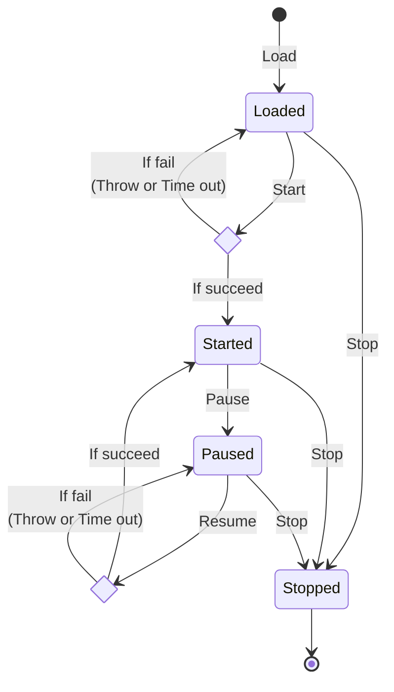

# Custom Plugins

## Basic Concepts

* Plugin: A plugin is the entry point between the Turms server and plugins. It describes plugin information and specifies which extensions the plugin implements.
* Extension: An extension is responsible for implementing extension points. An extension can implement multiple extension points.
* Extension Point: The Turms server provides interface classes that define which interfaces can be implemented by extensions. Extensions developed by plugin developers can implement these extension point interface classes. When the Turms server is running, it will call these extension point interfaces at the corresponding time.

## List of  Extension Points

| Category                              | Extension                      | Description                                                  |
| ------------------------------------- | ------------------------------ | ------------------------------------------------------------ |
| Admin class                           | AdminActionHandler             | Admin action handler. Used to monitor the administrator's API operations |
| User class                            | UserAuthenticator              | User login authentication. When the client requests turms-gateway to log in, turms-gateway will call the plugin to implement custom login authentication logic. With this plugin, you don't need to (optionally) synchronize user information in your business system to Turms |
|                                       | UserOnlineStatusChangeHandler  | User Online Status Change Handler. When any user enters the online or offline state, turms-gateway will call this interface |
| Request class                         | ClientRequestHandler           | Client service request handler. Used to modify request parameters (even transform into other business requests) and implement custom requests. This Handler will be called when turms receives a client service request. Through this plugin, you can implement sensitive word filtering and other functions |
| Notification and message class        | NotificationHandler            | Notification Handler. When a behavior needs to be notified to relevant users, turms-gateway will call this Handler. Commonly used to integrate custom third-party push services |
|                                       | ExpiredMessageDeletionNotifier | Expired message auto-deletion notification handler. When Turms automatically and regularly deletes expired messages, the Turms server will call this interface to inform the plugin implementer of all messages to be deleted. Commonly used for developer backup messages |
| Service implementation class          | StorageServiceProvider         | Storage service provider. The Turms project itself does not have a specific implementation of storage services, but only exposes storage service-related interfaces for the plugin to implement. (Refer to turms-plugin-minio) |
| Business Model Lifecycle Class (TODO) |                                |                                                              |

## Ways to Load Plugins

* Local loading: The Turms server will detect whether the JAR package ending with `.jar` file name and the JavaScript file ending with `.js` file name in the `plugins` directory of the release package are plugin implementations. If it is a plugin, They will be loaded when the Turms server starts.

  Note: The Turms server will not load plugins stored in the `lib` directory.

  Expanded information: [Directory structure of the Turms server release package](https://turms-im.github.io/docs/server/deployment/distribution#%E6%9C%8D%E5%8A%A1%E7%AB%AF%E5%8F%91%E5%B8%83%E5%8C%85%E7%9A%84%E7%9B%AE%E5%BD%95%E7%BB%93%E6%9E%84)

* Load via HTTP interface:

    * Add the API interface of the Java plugin: `POST /plugins/java`
    * Add the API interface of the JavaScript plugin: `POST /plugins/js`

  Expanded information: [plugin related API interface](https://turms-im.github.io/docs/server/development/plugin#%E6%8F%92%E4%BB%B6%E7%9B%B8%E5%85%B3api%E6%8E%A5%E5%8F%A3)

* Loading via turms-admin (based on "loading via HTTP"): On the `/cluster/plugin` page, administrators can also upload Java plugins and JavaScript plugins through the UI.

## Extension Lifecycle




In the table below, in the "Related Extension Hooks" column:

- "Execution succeeds" refers to when the function asynchronously responds successfully, not throwing an exception or timing out.
- "Execution completes" refers to when the function asynchronously responds successfully, throws an exception, or times out.

Please pay attention to the distinction between them.

### Main States

| State   | Related Extension Hooks                                      | Description                                                  | Trigger Events                                               |
| ------- | ------------------------------------------------------------ | ------------------------------------------------------------ | ------------------------------------------------------------ |
| Loaded  | None                                                         | The plugin has been loaded into memory.                      | 1. Automatically loaded and started by the server at startup.<br />2. Loaded via the admin HTTP API. |
| Started | start: The extension will enter the `started` state when the `start` function succeeds.<br />resume: The extension will enter the `started` state when the `resume` function succeeds. | The plugin has been started.<br />Only extension points of started and not paused extensions will be executed. | 1. Automatically loaded and started by the server at startup.<br />2. Started via the admin HTTP API. |
| Paused  | pause: The extension will enter the `paused` state when the `pause` function completes. | The plugin has been paused.<br />Extension points of paused extensions will not be executed. | Loaded via the admin HTTP API.                               |
| Stopped | stop: The extension will enter the `stopped` state when the `stop` function completes. | The plugin has been stopped.<br />A stopped extension cannot be started again, and its extension points will not be executed. | 1. Automatically closed by the server when shutting down.<br />2. Loaded via the admin HTTP API. |

### Main Extension Lifecycle Hooks

| Hooks  | Execution Condition                                          | Executable Times                          |
| ------ | ------------------------------------------------------------ | ----------------------------------------- |
| start  | Only when the extension is in the `loaded` state             | Can be executed successfully at most once |
| pause  | Only when the extension is in the `started` state            | Infinite times                            |
| resume | Only when the extension is in the `paused` state             | Infinite times                            |
| stop   | When the extension is in the `loaded`, `started`, or `paused` state | Can be completed at most once             |

Notes:

- When the events in the above table are triggered in the Turms server, the corresponding extension hooks will be executed.

  When implementing extensions, plugin developers can optionally implement the extension's hooks to listen to the extension's lifecycle and execute custom logic. For example, in the `start` hook, you can initialize and establish a network connection to your own server.

- Hooks support asynchronous execution. If these hooks are implemented in JavaScript, the implementation functions can return a Promise to implement asynchronous logic, but returning a Promise is not necessary.

- The Turms server guarantees that all lifecycle hooks of an extension are executed asynchronously in serial, not in parallel.

  For example, if the `start` hook of an extension is executing initialization logic, and at the same time, an administrator tries to stop the extension via an HTTP API. In this case, the Turms server will ensure that the `stop` lifecycle hook is called only when the asynchronous execution result of `start` has returned, thrown an exception, or timed out. Therefore, plugin developers do not need to worry about the scenario where two or more hooks are executed simultaneously.

Note: When loading a custom plugin via the Admin HTTP API, the extension of the plugin will not be automatically started. The administrator needs to call the `PUT /plugins` API to start the extension of the plugin.

## Ways to Implement Plugins

The Turms server supports plugin implementations based on JVM or JavaScript language.

|                  | JVM language plugin                                          | JavaScript plugin                                            |
| ---------------- | ------------------------------------------------------------ | ------------------------------------------------------------ |
| Language Version | Java 21 (Bytecode 65.0)                                      | ECMAScript 2022                                              |
| Advantages       | It is suitable for implementing functions with complex logic. <br />For example, the official plugin of the Turms project `turms-plugin-antispam` sensitive word filter plugin | Just create a new JavaScript file, you can directly write custom logic, no need to compile, no need to package;<br />It is convenient to support hot update |
| Disadvantages    | If you just implement a little custom logic, you still need to build a plugin project first, and then package the code into a Jar package based on the construction tool. The process is cumbersome | If you need to implement complex logic, it is better to implement it based on Java plugins;<br / >The memory overhead is larger than the Java plugin;<br />interpretation and execution, low operating efficiency |
| General Comments | It is more suitable for plugins that are complex, heavy-weight, and relatively fixed. <br />This type of plugin is more like a "project" | It is more suitable for small and lightweight plugins that need to support hot updates. <br />This type of plugin is more like a "small patch" |

### JVM Language Version (Take Java as an Example)

#### Implementation Steps

1. Install the JAR package dependencies of the Turms project for use when compiling your plugin

    * Clone Turms' warehouse. Reference command: `git clone --depth 1 https://github.com/turms-im/turms.git`
    * In the root directory of the Turms project (that is, the parent directory of the `.git` directory), execute the `mvn install -DskipUTs -DskipITs -DskipSTs` command to compile the Turms project source code, and automatically install the generated JAR package to the local In the Maven repository, for your plugin compilation

2. Build the plugin project

    * Option 1 (recommended): Clone the `turms/turms-plugin-demo` directory to the local, and develop based on this template. This solution can reduce unnecessary repeated configuration work.
    * Option 2: Manual construction. Specific steps are as follows:

        1. Create a new Maven project and add dependencies in `pom.xml` (to implement the turms-gateway server plugin, add turms-gateway dependencies. To implement turms-service plugins, add turms-service dependencies):

           ```xml
           <dependency>
               <groupId>im.turms</groupId>
               <artifactId>turms-gateway</artifactId>
               <version>0.10.0-SNAPSHOT</version>
               <scope>provided</scope>
           </dependency>
            
           <dependency>
               <groupId>im.turms</groupId>
               <artifactId>turms-service</artifactId>
               <version>0.10.0-SNAPSHOT</version>
               <scope>provided</scope>
           </dependency>
           ```

        2. (Optional) Add `maven-shade-plugin` to package the plugin into uber JAR package. If you do not want to package dependent JAR packages, you do not need to add this plugin, but you need to confirm that the dependent packages used by the plugin already exist in the Turms server.

           ```xml
           <plugin>
               <groupId>org.apache.maven.plugins</groupId>
               <artifactId>maven-shade-plugin</artifactId>
               <version>3.4.0</version>
               <executions>
                   <execution>
                       <phase>package</phase>
                       <goals>
                           <goal>shade</goal>
                       </goals>
                       <configuration>
                           <outputDirectory>${project.build.outputDirectory}</outputDirectory>
                           <!-- Prevent generating the "original" jar file -->
                           <finalName>${project.artifactId}-${project.version}</finalName>
                           <minimizeJar>true</minimizeJar>
                       </configuration>
                   </execution>
               </executions>
           </plugin>
           ```

        3. In the `resources` directory, create a new file named `plugin.yaml`, and add the following plugin description information (the specific parameter value is the information of your custom plugin)

           ```yaml
           id: com.mydomain.MyPlugin
           class: com.mydomain.MyPlugin
           version: 0.0.1
           provider: com.mydomain
           license: MIT
           description: ''
           ```
           in:

            * The `id` field is used to distinguish plugins. No format requirements, but must not be empty
            * The `class` field is used to guide the Turms server to load the `TurmsPlugin` implementation class in the JAR package, and must not be empty
            * The other fields are used for description and have no practical function at the moment, all of them can be empty

3. Create a new class that inherits from `TurmsPlugin`, such as `public class MyPlugin extends TurmsPlugin`, and then you can write the plugin implementation.

   in:

    * The custom subclass of `TurmsPlugin` is the entry class of the plugin, and must have a public no-argument constructor. Under the guidance of `plugin.yaml`, the Turms server will find this class and initialize it
    * `TurmsPlugin` comes with a function `getExtensions()` for the specified `TurmsExtension` class. It is used to guide the Turms server to load and initialize the custom `TurmsExtension` implementation in the plugin
    * `TurmsExtension` is the concrete implementation class of extended function points, a `TurmsExtension` can `implement` one or more `ExtensionPoint`, and must have a public no-argument constructor
    * `ExtensionPoint` is the interface of specific extended function points defined by the Turms server, such as `UserAuthenticator` and `ClientRequestHandler`

4. (Optional) Create a plugin configuration class, write the configuration required by the plugin, and configure the `org.springframework.boot.context.properties.ConfigurationProperties` annotation to define the configuration name prefix. Afterwards, you can initialize and automatically populate the configuration class through the `loadProperties` function under the implementation class of `TurmsExtension`.

   Take specific code as an example:

    ```java
    public class MyPlugin extends TurmsPlugin {
        @Override
        public Set<Class<? extends TurmsExtension>> getExtensions() {
            return Set.of(MyStorageServiceProvider.class);
        }
    }
   
    public class MyStorageServiceProvider extends TurmsExtension implements StorageServiceProvider {
        @Override
        public Mono<Void> start() {
            MyPluginProperties properties = loadProperties(MyPluginProperties. class);
            // your business logic
        }
        // your business logic. e.g.:
        // Mono<Void> deleteResource(Long requesterId, ContentType contentType, String keyStr, keyNum) {
        // return Mono. empty();
        // }
    }
   
    @ConfigurationProperties("my-plugin")
    @Data
    public class MyPluginProperties {
        private String whatever = "default";
    }
    ```

5. Use construction tools (such as Maven and Gradle) to compile and package the source code into a JAR package, and put the JAR package into the `plugins` directory of the Turms server. Note that Turms does not support loading JARs in the `plugins` subdirectory.

   The directory structure in the plugin JAR package is similar to:

    ```text
    ├─plugin.yaml
    ├─META-INF
    │ └─MANIFEST.MF
    └─com
      └─mydomain
        ├─MyStorageServiceProvider.class
        ├─MyPlugin.class
        └─MyPluginProperties.class
    ```

Notes:

* The Turms server will only detect whether the JAR package ending with `.jar` file name in the `plugins` directory is a plugin implementation, so if you put the plugin JAR package in the `lib` directory, these plugins will not be identified and used.
  *Turms does not implement access control for plugins, you need to ensure that there is no malicious code in the plugin. Note: Malicious plugins can not only call functions to directly force the shutdown of the Turms server, but can even directly control the operating system.
* Since the Turms server will be introduced into the Valhalla project in the future, the development process needs to pay special attention not to use the `synchronized` keyword to lock the objects of the eight basic packaging classes, otherwise an exception will be thrown directly.

#### Class Loader

The plugin classloader on the Turms server uses a parent-first classloading mechanism. Specifically, when a plugin implementation needs to use a class (such as third-party dependent classes: SLF4J, Netty, etc.), the plugin class loader will delegate the loading of the class to the parent class loader, so that the parent class loader will try to load first , implemented as a shared class with the host Turms server. If the host Turms server does not have the implementation of the dependency, then try to load the class implementation in the plugin JAR package. If there is no implementation of this class in the plugin JAR package, a `NoClassDefFoundError` exception will be thrown.

If there is an incompatibility conflict between the version of the third-party dependency package used by the plugin and the version of the dependency package used by the host Turms server, the plugin developer can pass the [Relocating Classes](https://maven.apache.org/plugins/maven-shade-plugin/examples/class-relocation) method to resolve dependency package conflicts.

Replenish:

* Because each plugin uses an independent plugin class loader, the classes in the plugin JAR package will only be used by the current plugin, and will not be used internally by other plugins or the host Turms server.
* The reason why Turms does not use the child-first class loading mechanism is: if the class loader of the plugin first loads the classes in the plugin JAR package, when these classes are passed to the host Turms server, because these classes with the same fully qualified name They are respectively loaded by the class loader of the plugin and the class loader (ie application class loader) used by the host Turms server, so the JVM will throw `java.lang.LinkageError`.

#### Plugin Debugging steps (Based on IntelliJ IDEA)

1. Under your plugin project, press `Ctrl + F9` to automatically compile and package your plugin JAR package to `<your plugin project root directory>/target` directory

2. Under the `turms-server-common` project, change the `getPluginDir` function implementation in the `im.turms.server.common.infra.plugin.PluginManager` class to:

    ```java
    private Path getPluginDir(Path home, String pluginsDir) {
        return Path.of("<your plugin project root directory>/target");
    }
    ```

3. Put a breakpoint on your plugin source code

4. Start the turms-service or turms-gateway server through IDEA, the server will automatically load the plugin JAR package in `<your plugin project root directory>/target`, and when the server executes to the breakpoint of your plugin source code , IDEA will suspend the running of the server for you to debug

### JavaScript Version

In order to realize the Java plugin, an engineering environment is required, and to realize the JavaScript plugin, only a new JavaScript file needs to be created.

#### Implementation Steps

Take the implementation of the `StorageServiceProvider` plugin as an example:

```javascript
class MyTurmsExtension extends TurmsExtension {
     getExtensionPoints() {
         return ['im.turms.plugin.MyExtensionPoint'];
     }

     testBool() {
         return true;
     }

     async testNotification(builders) {
         const builder = builders. get(0);
         const notification = builder. setCode(123)
             .setReason('reason')
             .build();
         const List = Java. type('java. util. List');
         return await List.of(notification);
     }
}

class MyTurmsPlugin extends TurmsPlugin {
     getDescriptor() {
     return {
         id: 'com.mydomain.myplugin',
version: '0.0.1',
     provider: 'com.mydomain',
         license: 'MIT',
description: ''
     };
}

     getExtensions() {
         return [MyTurmsExtension];
     }
}

export default MyTurmsPlugin;
```

Notes:

* The `MyTurmsExtension` class is a developer-defined extension of `TurmsExtension`, and the developer can customize the class name. in:
    * The `getExtensionPoints` function must exist and is used to return the names of the extension points implemented by the extension class. If the developer specifies an extension point but does not implement the interface function of the extension point, the Turms server will skip the plugin when executing the plugin callback function without reporting an error.

* The `MyTurmsPlugin` class is a developer-defined `TurmsPlugin` plugin, and the developer can customize the class name. in:
    * The `getDescriptor` function must exist, and the object it returns is the description information of the plugin:
        * The `id` field is used to distinguish plugins. No format required, but must not be empty.

        * The other fields are used for description and have no practical function at the moment, so they can all be empty.

    * The `getExtensions` function must exist, and the object it returns is an array of extension classes, such as `MyTurmsExtension` above.

* `export default` is used to export developer-defined plugins, such as `MyTurmsPlugin` above.

Notes:

* The Turms server will only detect whether the files ending with `.js` in the `plugins` directory are plugin implementations, so if you put the plugin JAR package in the `lib` directory, these plugins will not be Identify and use.
  *Turms does not implement access control for plugins, you need to ensure that there is no malicious code in the plugin. Note: Malicious plugins can not only call functions to directly force the shutdown of the Turms server, but can even directly control the operating system.
* The context environment is in the unit of plugin, that is, each plugin has its own independent context, and all functions of a plugin share one context. In other words, the function executed next time can see the changes made to the context by the function executed last time.
* JavaScript plugins can also access the Java classes and instances of the Turms server like Java plugins, and even call `System.exit()` directly, but it is not recommended to use JavaScript to write complex plugins
* Calling `Node.js` modules is not supported.

#### Main Global Objects

* The `load` function is GraalVM's [global function](https://www.graalvm.org/22.0/reference-manual/js/JavaScriptCompatibility/#global-properties), used to load external JavaScript resources.
* `turms` object. This object mounts:
    * `log` object, used for log printing
    * `fetch` function, used to send HTTP requests

TODO

#### Plugin Debugging Steps

In Debug mode (configure `turms.plugin.js.debug.enabled` to `true`, you can start Debug mode):

1. When the plugin host Turms Java server calls the JavaScript plugin function implemented by the proxy of the Java `Proxy` class (the proxy implementation source code is in: `im.turms.server.common.infra.plugin.JsExtensionPointInvocationHandler`), listen to JavaScript The WebSocket Debugger server of the plugin will wait for the developer to start the Debugger of the Chrome browser to ensure that the JavaScript plugin code will not be executed until the developer binds the Debugger. At this time, the Java calling thread that calls the JavaScript plugin function will enter the `WAITING` state, and wait for the execution of the JavaScript plugin function to complete.

2. In order to monitor the implementation of the JavaScript plugin code, the developer needs to open the Chrome browser and enter the monitoring address of the WebSocket Debugger server that monitors the JavaScript plugin. The developer can set a breakpoint for the JavaScript plugin code on this page for debugging. Among them, the listening address of the server will be printed on the console by the Turms server, similar to:

   > Debugger listening on ws://127.0.0.1:24242/bd62b7be-bdec-48a6-9ad0-9314af33d531
   > For help, see: https://www.graalvm.org/tools/chrome-debugger
   > E.g. in Chrome open: devtools://devtools/bundled/js_app.html?ws=127.0.0.1:24242/bd62b7be-bdec-48a6-9ad0-9314af33d531

   Among them, `devtools://devtools/bundled/js_app.html?ws=127.0.0.1:24242/bd62b7be-bdec-48a6-9ad0-9314af33d531` is the listening address.

3. After the Chrome Debugger is bound, the JavaScript plugin function will start to execute

4. After the JavaScript plugin function is executed, the Java calling thread will enter the `RUNNABLE` state, and the Java proxy function will then return the data returned by the JavaScript plugin function.

## configuration items

| config name                                             | default value | description                                                  |
| ------------------------------------------------------- | ------------- | ------------------------------------------------------------ |
| turms.plugin.enabled                                    | true          | Whether to enable the plugin mechanism                       |
| turms.plugin.dir                                        | `plugins`     | Directory where local plugins are located. The Turms server will load plugins from this directory |
| turms.plugin.network.proxy.enabled                      | false         | Whether to enable HTTP proxy when downloading network plugins |
| turms.plugin.network.proxy.username                     |               | HTTP proxy username                                          |
| turms.plugin.network.proxy.password                     |               | HTTP proxy password                                          |
| turms.plugin.network.proxy.host                         |               | HTTP proxy hostname                                          |
| turms.plugin.network.proxy.port                         | 8080          | HTTP proxy port number                                       |
| turms.plugin.network.proxy.connect-timeout-millis       | 60_000        | HTTP proxy connection timeout (milliseconds)                 |
| turms.plugin.network.plugins[?].url                     |               | Plugin URL                                                   |
| turms.plugin.network.plugins[?].type                    | `AUTO`        | Plugin type. <br />When the value is `AUTO`, the Turms server will detect the type of plugin according to the path of the URL: if the URL ends with `.jar`, it is judged as a Java plugin; if the URL ends with `.js`, then It is judged as a JavaScript plugin, otherwise the Turms server will throw an exception that the plugin type cannot be recognized. <br />When the value is `JAVA`, it is a Java plugin type<br />When the value is `JAVA_SCRIPT`, it is a JavaScript plugin type |
| turms.plugin.network.plugins[?].use-local-cache         | false         | Whether to use local plugin cache. If `false`, the Turms server will re-download plugins every time it starts |
| turms.plugin.network.plugins[?].download.http-method    | `GET`         | HTTP request method type when requesting plugin URL          |
| turms.plugin.network.plugins[?].download.timeout-millis | 60_000        | Timeout for downloading plugins (milliseconds)               |

## Plugin-related APIs

OpenAPI address: http://playground.turms.im:8510/openapi/ui#/plugin-controller


| **Controller**   | Path               | Role                   | General |
| :--------------- | ------------------ | ---------------------- | ------- |
| PluginController | GET /plugins       | Query plugins          | ✅       |
|                  | PUT /plugins       | Update plugins         | ✅       |
|                  | DELETE /plugins    | Delete plugins         | ✅       |
|                  | POST /plugins/java | Add Java plugin        | ✅       |
|                  | POST /plugins/js   | Add JavaScript plugins | ✅       |