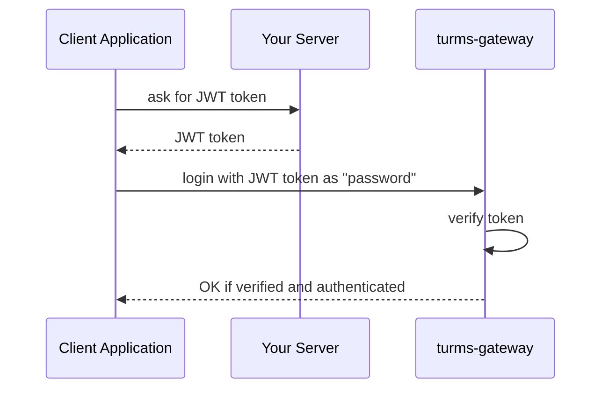
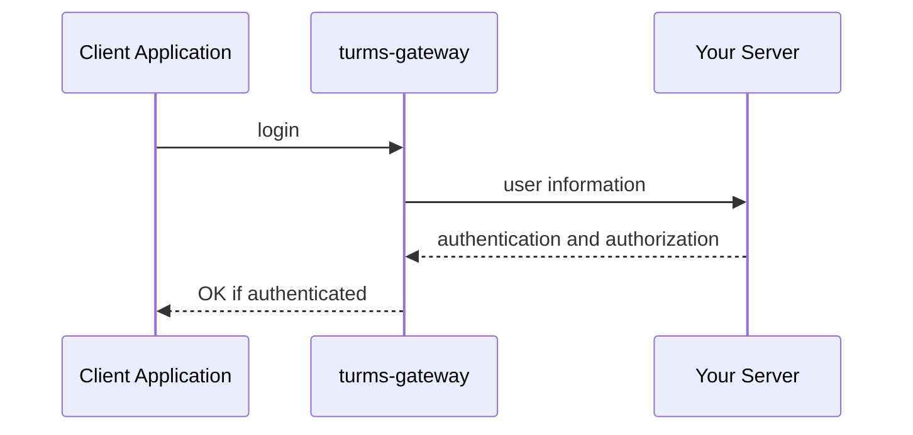

# Identity and Access Management

## Login authentication and authorization

Turms not only provides a built-in identity and access management mechanism, but also supports user-defined identity and access management implementation based on plug-ins.

### Related configuration

| config name                                              | default value | description                                                  |
| -------------------------------------------------------- | ------------- | ------------------------------------------------------------ |
| turms.gateway.session.identity-access-management.enabled | true          | Whether to enable the identity and access management mechanism. <br />If the value is `false`, turn off the Turms built-in identity and access management mechanism and user-based plug-in custom identity and access management implementation, and allow any user to log in, and authorize them to send any type of request |
| turms.gateway.session.identity-access-management.type    | password      | The type of Turms built-in identity and access management mechanism used. The type can be `noop`, `password`, `jwt`, `http`. See below for details |

### Built-in identity and access management mechanism

#### 1. NOOP

Turn off the built-in identity and access management mechanism, and allow any user to log in, and authorize it to send any request type.

##### Related configuration items

* turms.gateway.session.identity-access-management.type=noop

#### 2. Key-based authentication

User authentication is based on the password in the `user` collection in the MongoDB built by the Turms server. Authorization implementation is not currently supported.

##### Related configuration items

* turms.gateway.session.identity-access-management.type=password

#### 3. Based on JWT authentication

The JWT token contains the user's authentication and authorization information.

##### work process



* The client application applies for a JWT token from your server
* After the client application gets the JWT token, it sends the JWT string to the turms-gateway server through the `password` field in the Turms client login interface `turmsClient.userService.login`
* After the turms-gateway server gets the JWT token, according to the algorithm specified in the JWT token and the public key configuration configured by the developer on the turms-gateway server (asymmetric encryption algorithm: RS256, RS384, RS512, PS256, PS384 , PS512, ES256, ES384, ES512) or private key configuration (symmetric encryption algorithm: HS256, HS384, HS512) to verify the JWT token.
* If the developer does not configure the algorithm key configuration specified by JWT on the turms-gateway server, a corresponding error message will be returned to the client to inform the client that the algorithm is not supported
* If the JWT token verification is passed, the user is authenticated and authorized according to the authentication and authorization information of the JWT token
* If the JWT token verification fails, return the corresponding error message to the client

##### JWT body (Payload) format

```json
{
     "iss": string, // issuer
     "sub": string, // subject
     "aud": array<string>, // audience
     "exp": number, // expiration time
     "nbf", number, // not before

     "authenticated": true,
     "statements": [{
         "effect": "ALLOW", // or "DENY"
         "actions": "*", // a string of ["*", "CREATE", "DELETE", "UPDATE", "QUERY"], or an array that contains these strings
         "resources": "*" // a string of ["*", "USER", "GROUP_BLOCKED_USER", ...], or an array that contains these strings
     }]
}
```

in:

* The five JWT public statements `iss`, `sub`, `aud`, `exp` and `nbf` can be used for JWT verification. Except for the `sub` statement that must exist, the other four statements can not exist. That is, no logical verification related to the statement is performed.

  * `iss` (issuer): The issuer of the JWT, such as `www.my-server.com`. It can be verified with the configuration item `turms.gateway.session.identity-access-management.jwt.verification.issuer`.

  * `sub` (subject): The user the JWT is issued to, such as `123456789`. This field must be the same as the user's login user ID.

  * `aud` (audience): The recipient of the JWT, such as `www.my-turms.com`. It can be verified with the configuration item `turms.gateway.session.identity-access-management.jwt.verification.audience`.

  * `exp` (expiration time): JWT expiration time, such as `1600000000`. After that time, the JWT is invalid.

  * `nbf` (not before): Before this time, the JWT is invalid, such as `1600000000`.

* `authenticated`: private boolean statement, indicating whether the user is authenticated, if it is `true` (note: the `true` can be either a boolean value or a string), it means the authentication is passed, otherwise it is not passed.

* `statements`: Private array statement, indicating the permissions of the user, the maximum length of the array is 100.

  * The `effect` field can be `ALLOW` for "allowed permissions", or `DENY` for "forbidden permissions". The priority of permissions prohibited by `DENY` is always higher than that allowed by `ALLOW`, and will not be affected by the declaration order of `statements`.

    `DENY` is usually used together with `ALLOW`, such as permission "All permissions are allowed except CREATE USER and GROUP_BLOCKED_USER resource permissions are prohibited":

    ```json
    [{
        "effect": "DENY",
        "actions": "CREATE",
        "resources": ["USER", "GROUP_BLOCKED_USER"]
    }, {
        "effect": "ALLOW",
        "actions": "*",
        "resources": "*"
    }]
    ```

  * The `actions` field represents the authorized behavior, and its value can be either the following string or an array containing the following strings, such as `["CREATE", "DELETE"]`:

    * `*`: all actions
    * `CREATE`: create behavior
    * `DELETE`: delete behavior
    * `UPDATE`: update behavior
    * `QUERY`: query behavior

  * The `resources` field indicates authorized resources (that is, whether the user has permission to send requests related to these resources), and its value can be either the following string or an array containing the following strings, such as `["USER ", "MESSAGE"]`:

    * `*`: all resources
    * `USER`: user data related resources
    * `USER_LOCATION`: user location related resources
    * `USER_ONLINE_STATUS`: resources related to user online status
    * `USER_PROFILE`: resources related to user personal information
    * `NEARBY_USER`: Nearby user related resources
    * `RELATIONSHIP`: user relationship related resources
    * `RELATIONSHIP_GROUP`: user relationship group related resources
    * `FRIEND_REQUEST`: Friends request related resources
    * `GROUP`: group information related resources
    * `GROUP_BLOCKED_USER`: Group blocked user related resources
    * `GROUP_INVITATION`: Group invitation related resources
    * `GROUP_JOIN_QUESTION`: resources related to joining group questions
    * `GROUP_JOIN_QUESTION_ANSWER`: Relevant resources for joining group questions and answers
    * `GROUP_JOIN_REQUEST`: Join the group to request related resources
    * `GROUP_MEMBER`: resources related to group members
    * `JOINED_GROUP`: related resources of the joined group
    * `MESSAGE`: message related resources
    * `CONVERSATION`: session-related resources
    * `TYPING_STATUS`: input status related resources
    * `RESOURCE`: storage resource related resources

##### Related configuration items

| config name                                                  | default value             | description                                                  |
| ------------------------------------------------------------ | ------------------------- | ------------------------------------------------------------ |
| turms.gateway.session.identity-access-management.type        | password                  | Set to `jwt` to enable JWT-based identity and access management |
| turms.service.message.check-if-target-active-and-not-deleted | true                      | When using the `JWT` mechanism, you need to set this configuration item to `false`, otherwise because it does not exist in the Turms database the user, so the user will not be able to send messages |
| turms.gateway.session.identity-access-management.jwt.verification.issuer |                           | When the value is not empty, verify whether the issuer of the JWT is equal to this value |
| turms.gateway.session.identity-access-management.jwt.verification.audience |                           | When the value is not empty, verify whether the receiver of the JWT contains this value |
| turms.gateway.session.identity-access-management.jwt.verification.custom-payload-claims |                           | When the value is not empty, verify that the private claims in the JWT match this value |
| turms.gateway.session.identity-access-management.jwt.authentication.expectation.custom-payload-claims | { "authenticated": true } | Match this value in the JWT's private claim, if the match is successful, it indicates that the User has been authenticated |
| turms.gateway.session.identity-access-management.jwt.algorithm.hmac256.file-path |                           | key file path. Developers only need to configure this key or a group in P12 below |
| turms.gateway.session.identity-access-management.jwt.algorithm.hmac256.p12.file-path |                           | PKCS#12 file path                                            |
| turms.gateway.session.identity-access-management.jwt.algorithm.hmac256.p12.password |                           | PKCS#12 key                                                  |
| turms.gateway.session.identity-access-management.jwt.algorithm.hmac256.p12.key-alias |                           | key alias                                                    |
| turms.gateway.session.identity-access-management.jwt.algorithm.hmac256.p12.key-password |                           | key password. When empty, it defaults to the PKCS#12 key     |
| turms.gateway.session.identity-access-management.jwt.algorithm.rsa256.pem-file-path |                           | PEM file path. Developers only need to configure the PEM or a set of P12 below |
| turms.gateway.session.identity-access-management.jwt.algorithm.rsa256.p12.file-path |                           | PKCS#12 file path                                            |
| turms.gateway.session.identity-access-management.jwt.algorithm.rsa256.p12.password |                           | PKCS#12 key                                                  |
| turms.gateway.session.identity-access-management.jwt.algorithm.rsa256.p12.key-alias |                           | public key alias                                             |
| The configuration of rsa384/rsa512/ps256/ps384/ps512/ecdsa256/ecdsa384/ecdsa512 is the same as the above `rsa256` |                           |                                                              |

#### 4. Identity and access management mechanism based on external HTTP response

The HTTP response contains the user's authentication and authorization information.

##### work process



* The client sends a login request to the turms-gateway server through the Turms client login interface `turmsClient.userService.login`

* The turms-gateway server will send an HTTP request to your HTTP server, and the format of the request body is:

   ```json
   {
       "version": 1,
       "userId": number,
       "password": string,
       "loggingInDeviceType": string,
       "deviceDetails": object,
       "userStatus": string,
       "location": string,
       "ip": string
   }
   ```

* Your HTTP server returns the user's authentication and authorization information according to the "HTTP Response Format" below

* turms-gateway authenticates and authorizes users based on the HTTP response

##### HTTP response format

```json
{
     "authenticated": true,
     "statements": [{
         "effect": "ALLOW", // or "DENY"
         "actions": "*", // a string of ["*", "CREATE", "DELETE", "UPDATE", "QUERY"], or an array that contains these strings
         "resources": "*" // a string of ["*", "USER", "GROUP_BLOCKED_USER", ...], or an array that contains these strings
     }]
}
```

The meanings of `authenticated` and `statements` fields are the same as those of the corresponding statements in the JWT text above, so I won’t repeat them here.

##### Related configuration items

| config name                                                  | default value             | description                                                  |
| ------------------------------------------------------------ | ------------------------- | ------------------------------------------------------------ |
| turms.gateway.session.identity-access-management.type        | password                  | Set to `http` to enable identity and access management based on external HTTP responses |
| turms.service.message.check-if-target-active-and-not-deleted | true                      | When using the `HTTP` mechanism, you need to set this configuration item to `false`, otherwise because it does not exist in the Turms database the user, so the user will not be able to send messages |
| turms.gateway.session.identity-access-management.http.request.url | ""                        | Request URL                                                  |
| turms.gateway.session.identity-access-management.http.request.headers | true                      | additional request headers                                   |
| turms.gateway.session.identity-access-management.http.request.http-method | GET                       | request method                                               |
| turms.gateway.session.identity-access-management.http.request.timeout-millis | 30000                     | Request timeout                                              |
| turms.gateway.session.identity-access-management.http.authentication.response-expectation.status-codes | "2??"                     | Match this value in the response status code, if the match is successful, continue to other matches, Otherwise authentication fails |
| turms.gateway.session.identity-access-management.http.authentication.response-expectation.headers |                           | Match the value in the response header, if the match is successful, continue to other matches, otherwise the authentication fails |
| turms.gateway.session.identity-access-management.http.authentication.response-expectation.body-fields | { "authenticated": true } | Match this value in the response body, if the match is successful, continue with other matches , otherwise authentication fails |

### Plug-in-based custom identity and access management implementation

Authentication plugin interface: `im.turms.gateway.infra.plugin.extension.UserAuthenticator`

Authorization plug-in interface: TODO

Readers can refer to [plugin implementation](https://turms-im.github.io/docs/server/development/plugin#%E6%8F%92%E4%BB%B6%E5%AE%9E%E7%8E%B0), implement the above plug-in interface.

## Authentication and authorization of business logic

For the permission information sent by the client, the attitude of the Turms server is "the permission information sent by the client is not trustworthy", so the Turms server will do all necessary things according to the business configuration you set on the Turms server. authority judgment.

Take the "modify sent message" function as an example, this behavior will trigger a series of decision logic. Turms will first judge whether the target message is indeed sent by the user, and then judge whether to allow the user to modify the sent message according to the `allowEditMessageBySender` configured on the Turms server (default is true), if you set it to false, Then a `ResponseException` (Kotlin) or `ResponseError` (JavaScript/Swift) object will be captured on the client side, and it is represented by the business status code model `ResponseStatusCode` (composed of `code` and `reason` description information) .

For another example, for a "simple" "send message" request, the Turms server will determine whether the user who sent the message is active, whether "allow sending messages to strangers (non-related persons)" is set, and whether the sender of the message is in the blacklist. If the recipient is a group, then it is logically judged whether the sender of the message is a member of the group, and whether it is in a mute state. And you just need to call a `sendMessage(...)` interface.