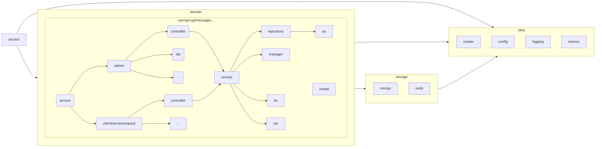
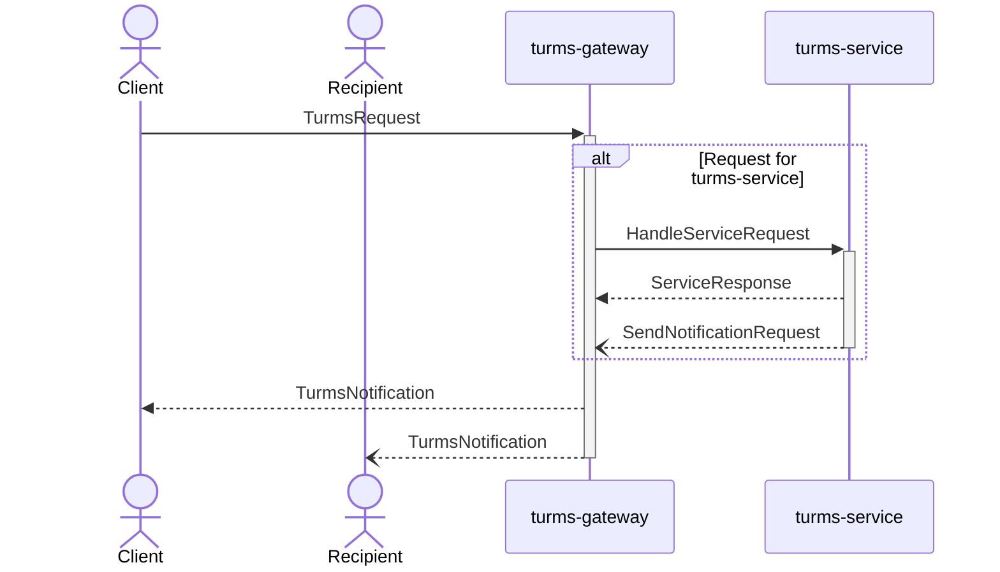
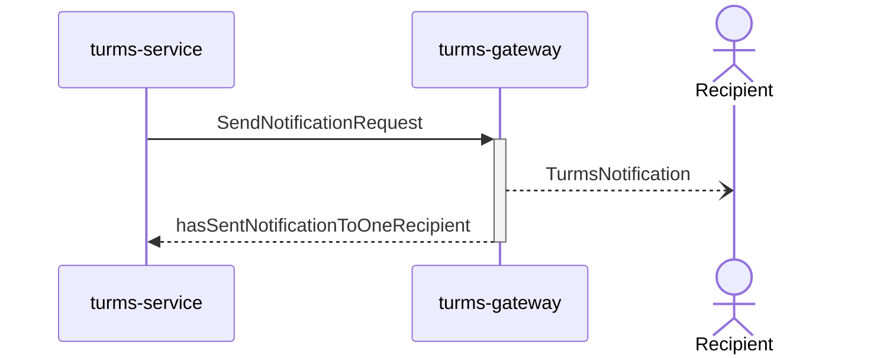
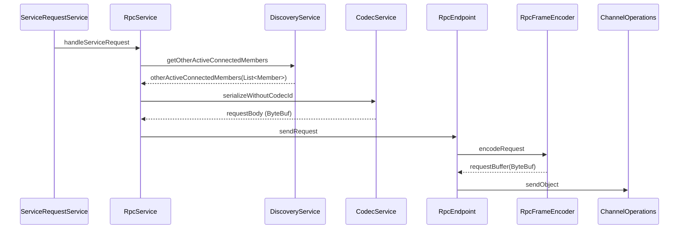

# 源码

本文讲解Turms服务端的包结构与各主要功能模块的大致源码实现，以帮忙开发者更快地阅读源码与理解相关流程。

提醒：

1. Turms服务端重度使用[reactor-core](https://projectreactor.io/docs/core/release/reference)这一响应式框架，本文默认读者已经熟练掌握响应式编程，如果读者还没掌握响应式编程，则建议先自行学习并掌握[reactor-core](https://projectreactor.io/docs/core/release/reference)。
2. Turms会不定期优化代码，一些函数名或函数实现可能会稍微改变，但其思想是不会变的。
3. 各模块源码所做的事情通常比下文讲得多得多，但为了方便读者理解，**本文只挑选主要流程进行讲解，并略去了大量细节**。如果读者对其中的细节感兴趣，可以在阅读完本文的相关讲解，并对主要流程有大概的认识后，再去阅读源码，了解其具体实现细节。

## 项目结构

我们常说代码即文档，代码可以让读者从微观视角了解各功能的实现细节与逻辑关系，而包则像是文档的目录。好的分包应该在宏观上清晰地展示“文档”的层次与结构，以便于读者理解。本文讲解Turms服务端的包结构，以帮忙开发者更好地理解包之间的关系与层次。

### 背景（拓展内容）

不管是什么样的分包理念，其实基础的分包类别就只有四种：按特性分（Feature）、按类型分（Type）、按层分（Layer）与不分包，各种上层的设计理念只是对这些基础分包类别的不同组合。

另外就算是同一个项目，其在不同的发展阶段通常也是会适用不同的包结构。我们经常说架构是演进式发展的，包分类其实也需要演进式发展。比如说Turms服务端在早期阶段，一共也没几个模块，而按今天Turms服务端给一堆模块分包的思路去给早期Turms服务端做包结构设计，那结果就是：包结构可读性不升反降，为了设计而设计，即过度设计。

### 分包目标（拓展内容）

做分包设计时必须要有明确目标，不然很容易陷入到`为了套某种包设计，而强行分包`的情况，诸如一些项目Service层先写接口类再写实现类，而不去思考设计规范中为什么需要这样的接口，又或者强行套用DDD分层模板，而不去思考一些设计是不是已经严重违背约定俗成的惯例了，导致编程时反而束手束脚。

Turms服务端项目的分包主要目标有：

* 尽量保证功能特性模块的高内聚，降低模块的复杂度。这点主要是出于代码的可维护性考虑，以避免陷入非常常见的`按特性+按类型的混合设计`或`按特性+按类型+按分层的混合设计`，因为混合设计既会让代码的归属问题变得模棱两可，又也会因为一层包下使用了不同的分包策略而降低包结构的可读性，不利于长期维护。
* 尽量保证业务子域的独立性。这点主要是为了划清业务边界，让各模块易读与易改（额外一提，turms-service未来会支持以各种业务域组合形态做部署，举例来说，turms-service未来既可以部署成用户业务域的服务，也可以部署成消息业务域的服务，也可以部署成用户+消息业务域的服务等等）。
* 支撑域的功能特性模块与业务模块一定要分开。这点主要是为了划清问题域与支撑域的边界。
* 尽量让开发者通过包结构就能推测包的上下游关系。这点主要出于代码的可读性考虑，在长期的编程实践中，当我们看到中大型项目的包结构不做分层的代码，那我们可能就得自己翻几遍包或代码，才推测可能的包上下游关系。
* 在能保证逻辑清晰的情况下，尽量让包的层次少一点。

另外，在阅读各种优秀开源项目的包结构时，我们会发现大部分知名的中大型开源服务端项目可能压根就不做分层设计，并且通常是以`按功能特性分包为主，以按类型分包为辅`做混合设计，又或者是按照常规的MVC或DDD分层设计。对于这些分包思路，我们一般会评价“中规中矩，符合惯例，但差强人意”，因为它们并没有很好的满足上述的`分包目标`，很多开发者在阅读这些项目的源码时也会陷入到“不知道从哪读起”的情况，编码时也会经常遇到代码模棱两可的归属问题。

### 分包思路

各种分包理念通常只是在理想场景下提供了种思路，切不可直接盲目套用。我们在给Turms服务端设计包结构时，主要参考：各种分包的设计理念、优秀开源项目的实践与实际效果、约定俗成的惯例、项目规模、项目类型、包的规模、长期的编程实践的体会。

因此，各种分包理念只是“参考建议”，实操时到底是要靠长期编程的实践与体会，判断各种设计适不适合Turms项目的实际情况，并对各种分包理念做了取长补短，读者也可以从Turms服务端项目的包结构中看到很多设计理念、甚至是基于DDD微服务设计的影子。具体而言，Turms服务端的分包示意图如下：



上图框里的名称就是实际Turms服务端中包的名称，其连线就是包与包之间的逻辑关系。其中：

第一层按层来分包，分别是`access`、`domain`、`storage`与`infra`这四层，其中：

* access：接入层，负责管理员与客户端的会话管理与请求调度。该层会将用户请求分发给`domain`层的`access`层。

* domain：业务域层，负责处理各种业务域相关的逻辑。domain层内部按照常见的分层分包设计，分为`access`、`service`与`repository`三层。
  * 其中，相对比较特别的是`domain`层中的`access`层。因为`service`的上层不仅有调度管理员HTTP请求的Controller层`admin`，还有调度客户端请求的Controller层`client`或`servicerequest`（对于turms-gateway来说是`client`包，而对于turms-service来说是`servicerequest`包）。二者共享Service层，因此使用一个单独的`accecss`层来涵盖这两层。
  
  * 关于为什么要单独抽个`model`出来
  
    像是上图中`dto`（Data Transfer Object）/`bo`（Business Object）/`po`（Persistent Object）都是贫血模型，只有`model`是充血模型，它们不仅要存储状态（数据），还自带些行为（逻辑），用于处理各种高内聚的逻辑，比较特别，因此单独分包。
  
  * 关于`rpc`包
  
    一些域（domain）具有它自己独有的RPC请求，则这些RPC请求都会被归到该域下。如`Session`域下的`im.turms.server.common.domain.session.rpc.SetUserOfflineRequest`这一RPC请求。
  
    额外一提，集群RPC的实现在`im.turms.server.common.infra.cluster.service.rpc`包下。
  
* storage：存储层，提供MongoDB客户端管理与Redis客户端管理，分别对应`mongo`包与`redis`包。

* infra：基础服务层，负责为`access`与`domain`层提供基础功能实现，如日志处理、配置管理等。infra层内部按照功能特性分包。

综上，Turms服务端的分包其实设计得很巧妙：

* 通过`access`、`domain`、`storage`与`infra`这四层，开发者可以基于已掌握的MVC分层知识，快速理解Turms服务端的源码层次，并能根据包名清楚地明白每层包跟用户会话与用户请求是什么关系。
* 而`domain`层的各业务域又可以帮助开发者快速区分各Turms服务端有哪些业务域。而每个域的内部又基于常见的MVC分层设计，开发者可以基于以往知识，快速理解一个业务域的内部上下游逻辑关系。
* `infra`层又可以帮助开发者理解Turms服务端的支撑域具体包括哪些功能模块。

因此这样的分包层次其实是比较清晰的，有利于长期维护。另外，读者可能已经从上述的分包实践中，看出了很多分包理念的影子，而Turms只是参考这些理念做的设计，并不需要遵循这些分包理念。

补充：

* 关于为什么不把第一层包拆分成模块（Java Modules），这是因为现阶段既没分模块的必要，分模块还会增加项目结构的复杂度，如无必要，勿增实体。
* Turms服务端的贫血模型大部分是用Java的`record`表示的，但还有些贫血模型因为性能原因（改动一个字段是否需要重新new个新对象），仍用`class`表示。

### 请求处理在包之间的流转过程

读者在理解上文的Turms分包设计之后，应该已经能对Turms服务端的请求处理流程有比较清晰的认识了。这里以最经典的“客户端登陆”为例，并以包的视角简要地串讲相关流程（读者可结合上述的分包示意图进行阅读），帮忙读者更清晰地理解包的分层设计。

* 客户端登陆时，首先要与turms-gateway服务端建立纯TCP或WebSocket连接，此时处理网络连接的是`access`层，因为它是客户端连接，因此是`access/client`层（而不是`access/admin`）。

* 建立完网络连接后，客户端发送给turms-gateway登陆请求时，turms-gateway会将解析后的请求经由`access`层传递给`domain/session/access/client/controller`层的Controller进行处理，Controller再将具体业务逻辑交由`domain/session/access/client/service`层的Service进行处理，而Service又会将：1. 相关的MongoDB数据库的查询操作，交由`domain/session/access/client/repository`层的Repository进行处理，Repository只是对相关CRUD语句的拼接，而这些语句又会传递给`storage/mongo`这层的MongoDB客户端实现，它们会向MongoDB服务端发送最终的请求；2. 相关的Redis操作则交由`storage/redis`这层处理。

  等请求处理完毕，则通过回调并根据包的上下游关系，依次返回。

* 而对于`infra`这层与其他各种子包，绝大部分也就是为上面的各层提供各种能力的支持，如`infra/logging`日志包与`infra/cluster`集群实现包。

其他各类请求（管理员HTTP请求、客户端基于TCP/WebSocket连接的业务请求）的处理流程也大致同上，读者可以自行举一反三。

下面的篇章会继续以更为细致的源码视角，对客户端请求的处理流程进行讲解。

## 客户端请求处理流程

阅读下文前，建议读者先行阅读[客户端访问服务端标准流程](https://turms-im.github.io/docs/zh-CN/design/architecture#%E5%AE%A2%E6%88%B7%E7%AB%AF%E8%AE%BF%E9%97%AE%E6%9C%8D%E5%8A%A1%E7%AB%AF%E6%A0%87%E5%87%86%E6%B5%81%E7%A8%8B)，先从架构角度理解其背后的设计思路，这样在读源码的时候就不容易“迷路”。

请求模型：`im.turms.server.common.access.client.dto.request.TurmsRequest`

响应与通知模型：`im.turms.server.common.access.client.dto.notification.TurmsNotification`

### UML顺序图



### turms-gateway

简介：用于维护与客户端的网络连接，维护应用层会话，并将大部分的业务请求下发给turms-service服务端。

#### 网络层配置

1. 启动接收客户端请求的服务端

   TCP服务端：`im.turms.gateway.access.client.tcp.TcpServerFactory#create`

   WebSocket服务端：`im.turms.gateway.access.client.websocket.WebSocketServerFactory#create`

   这两个函数主要做的就是：基于`reactor-netty`库，绑定服务端的监听地址、配置EventLoop线程池、（可选）配置SSL、开启相关度量等常规服务端相关工作。

2. 对于纯TCP连接（而非预备的WebSocket连接），给新确立的TCP连接绑上编解码Handlers

   在`im.turms.gateway.access.client.tcp.TcpServerFactory#create`函数内，通过下述回调，给新TCP连接绑上对应的`TurmsRequest`与`TurmsNotification`的编解码实例。

   ```java
   .doOnConnection(connection -> {
       // Inbound
       connection.addHandlerLast("varintLengthBasedFrameDecoder", CodecFactory.getExtendedVarintLengthBasedFrameDecoder(maxFrameLength));
       // Outbound
       connection.addHandlerLast("varintLengthFieldPrepender", CodecFactory.getVarintLengthFieldPrepender());
       connection.addHandlerLast("protobufFrameEncoder", CodecFactory.getProtobufFrameEncoder());
   });
   ```

3. 对于WebSocket连接，则先监听并校验HTTP Upgrade请求，然后再Upgrade成WebSocket连接

   在`im.turms.gateway.access.client.websocket.WebSocketServerFactory#create`函数内，通过下述代码绑定HTTP监听回调：

   ```
   .handle(getHttpRequestHandler(handler, serverSpec))
   ```

   其中`getHttpRequestHandler`函数来自`im.turms.gateway.access.client.websocket.WebSocketServerFactory#getHttpRequestHandler`，该回调用于校验HTTP请求，如果监听到是合法的HTTP Upgrade请求，则将该连接升级为WebSocket连接。

至此，纯网络层的操作基本就完成了，下一步就是衔接网络层与业务逻辑层。

#### 网络层与业务逻辑层的衔接

1. 网络层与业务逻辑层，通过函数接口：`im.turms.gateway.access.client.common.connection.ConnectionListener#onAdded`进行绑定，主要绑定的内容就是：TCP连接的输入字节流、输出字节流、关闭时的回调函数。

   对于TCP服务端，在`im.turms.gateway.access.client.tcp.TcpServerFactory#create`函数下，通过`.handle((in, out) -> connectionListener.onAdded((Connection) in, false, in.receive(), out, ((Connection) in).onDispose()))`进行绑定。

   对于WebSocket服务端，在`im.turms.gateway.access.client.websocket.WebSocketServerFactory#create`函数下，通过`connectionListener.onAdded((Connection) in, true, inbound, out, onClose)`绑定。

2. 上述`connectionListener.onAdded`会调用下述的`UserSessionAssembler#bindConnectionWithSessionWrapper`回调函数，用于协调处理输入字节流与输出字节流的逻辑，而从全局视角来看，这些字节数据本质上就是上层业务层的`请求`、`响应`与`通知`，因此这部分代码是服务端与客户端交互的重点，我们之后还会回看这块代码。其源码如下：

   ```java
   ConnectionListener bindConnectionWithSessionWrapper() {
       return (connection, isWebSocketConnection, in, out, onClose) -> {
           InetSocketAddress address = (InetSocketAddress) connection.address();
           NetConnection netConnection = createConnection(connection);
           UserSessionWrapper sessionWrapper = new UserSessionWrapper(netConnection, address, closeIdleConnectionAfterSeconds,
                   userSession -> userSession.setNotificationConsumer((turmsNotificationBuffer, tracingContext) -> {
                       turmsNotificationBuffer.touch(turmsNotificationBuffer);
                       turmsNotificationBuffer = turmsNotificationBuffer.duplicate();
                       NettyOutbound outbound = isWebSocketConnection
                               ? out.sendObject(new BinaryWebSocketFrame(turmsNotificationBuffer))
                               : out.sendObject(turmsNotificationBuffer);
                       return Mono.from(outbound)
                               .doOnError(t -> handleConnectionError(t, netConnection, userSession, tracingContext));
                   }));
           respondToRequests(connection, isWebSocketConnection, in, out, sessionWrapper);
           return tryRemoveSessionInfoOnConnectionClosed(onClose, sessionWrapper);
       };
   }
   ```

   其中，`userSession.setNotificationConsumer`用于设置监听`通知`的回调函数，该回调函数会将接收到的`通知`字节数据，发送给客户端。这个回调函数也是重点，因为我们之后讲到的turms-service给turms-gateway发送`通知`的流程，其最终会回到这里。

   而`respondToRequests`函数则用于监听`请求`输入字节流，并在下游代码处理完`请求`后，转发其返回的`响应`输出字节流。该函数源码如下：

   ```java
   void respondToRequests(Connection connection,
                          boolean isWebSocketConnection,
                          Flux<ByteBuf> in,
                          NettyOutbound out,
                          UserSessionWrapper sessionWrapper) {
       in
               .doOnNext(requestData -> {
                   if (connection.isDisposed()) {
                       return;
                   }
                   requestData.retain();
                   TracingContext ctx = new TracingContext();
                   clientRequestDispatcher.handleRequest(sessionWrapper, requestData)
                           .onErrorResume(throwable -> {
                               ctx.updateThreadContext();
                               handleNotificationError(throwable, sessionWrapper.getUserSession());
                               return Mono.empty();
                           })
                           .flatMap(turmsNotificationBuffer -> {
                               turmsNotificationBuffer.touch(turmsNotificationBuffer);
                               turmsNotificationBuffer = turmsNotificationBuffer.duplicate();
                               NettyOutbound outbound = isWebSocketConnection
                                       ? out.sendObject(new BinaryWebSocketFrame(turmsNotificationBuffer))
                                       : out.sendObject(turmsNotificationBuffer);
                               return Mono.from(outbound);
                           })
                           .contextWrite(context -> context.put(TracingContext.CTX_KEY_NAME, ctx))
                           .doFinally(signal -> ctx.clearThreadContext())
                           .subscribe(null, t -> handleConnectionError(t, sessionWrapper.getConnection(),
                                   sessionWrapper.getUserSession(), ctx));
               })
               .then()
               .subscribe(null, t -> handleConnectionError(t, sessionWrapper.getConnection(),
                       sessionWrapper.getUserSession(), TracingContext.NOOP));
   }
   ```

   其中，`respondToRequests`在`clientRequestDispatcher.handleRequest(sessionWrapper, requestData)`处，将`请求`的字节流`ByteBuf`，递交给下游的业务逻辑层进行处理；在`.flatMap(turmsNotificationBuffer -> {`回调处，将请求的`响应`字节流进行输出。

   至此，网络层的数据已经传达到了下游业务层，网络层`接收请求`的工作结束了，接下来就都是业务层相关操作。

   注意：虽然网络层`接收请求`的工作结束了，但网络层之后还要处理下游业务逻辑层发回的`响应`与`通知`字节数据，而这收尾的代码，上文已经提及，就不赘述了。

#### 业务层——请求调度层

经由网络层的操作，来到了`im.turms.gateway.access.client.common.ClientRequestDispatcher#handleRequest`。该函数完成：调度心跳请求、业务请求；简单校验请求，如果是非法请求，则尝试封禁用户ID与IP等。

该函数的代码虽多，但其实很容易读，我们这里主要关注的是`handleServiceRequest(sessionWrapper, request, serviceRequestBuffer, tracingContext)`这行代码，`handleServiceRequest`函数的主要源码如下：

```java
return switch (requestType) {
    case CREATE_SESSION_REQUEST -> sessionController
            .handleCreateSessionRequest(sessionWrapper, request.createSessionRequest())
            .map(result -> getNotificationFromHandlerResult(result, request.requestId()));
    case DELETE_SESSION_REQUEST -> sessionController.handleDeleteSessionRequest(sessionWrapper);
    default -> {
        serviceRequestBuffer.retain();
        yield handleServiceRequest(sessionWrapper, request, serviceRequestBuffer);
    }
};
```

* 将`CREATE_SESSION_REQUEST`与`DELETE_SESSION_REQUEST`这两个turms-gateway能自行处理的请求交由turms-gateway自己的Controller层进行处理，即`SessionController`，该Controller主要就是借由`im.turms.gateway.domain.session.service.SessionService`服务与Redis服务端进行交互，执行用户`登陆`与`登出`相关逻辑。由于业务逻辑并非本篇的重点，这里就不展开讲了。

  等这Controller与Service的逻辑都处理完，则返回一个`TurmsNotification`对象，并经由上述的网络层与编解码Handlers，最终将字节数据发送给客户端。

* 对于其他所有请求，turms-gateway通过上述的`handleServiceRequest`函数，最终经由RPC，将客户端请求下发给turms-service进行处理。其中，`handleServiceRequest`函数会调用`node.getRpcService().requestResponse(request)`通过自研RPC框架，将包装有客户端请求字节数据的RPC请求`im.turms.server.common.access.servicerequest.rpc.HandleServiceRequest`下发给turms-service进行处理。具体RPC的实现并非本篇重点，这里就不展开讲了。

  等turms-service处理完请求，会返回一个`im.turms.server.common.access.servicerequest.dto.ServiceResponse`，该对象会在上述的`im.turms.gateway.domain.servicerequest.service.ServiceRequestService#handleServiceRequest`函数中，经过下述的`getNotificationFromResponse`函数将`ServiceResponse`转换为`TurmsNotification`，并再经由上述的网络层与编解码Handlers，最终将字节数据发送给客户端：
  
  ```java
  return node.getRpcService().requestResponse(request)
          .defaultIfEmpty(REQUEST_RESPONSE_NO_CONTENT)
          .map(response -> getNotificationFromResponse(response, serviceRequest.getRequestId()));
  ```

至此，turms-gateway的客户端请求的处理逻辑就讲解完了，下文接着讲解turms-service是如何处理上游turms-gateway发来的RPC请求的。

### turms-service

（RPC实现属于“集群服务”实现内容，这里不做相关讲解）

1. 请求调度层

   经由RPC层的处理，turms-service会首先通过`im.turms.service.access.servicerequest.dispatcher.ServiceRequestDispatcher#dispatch`拿到客户端请求的字节数据。该函数会调用`im.turms.service.access.servicerequest.dispatcher.ServiceRequestDispatcher#dispatch0`函数，完成诸如：请求校验、客户端封禁、判断服务端监控状态、触发插件与调用Controller层接口函数、触发上游等任务。

   该函数的代码虽多，但其实还是比较容易读的，这里我们主要看到其中的`result = result.switchIfEmpty(Mono.defer(() -> handler.handle(lastClientRequest)));`这行代码，其中的`handler#handle`函数其实就是`im.turms.service.access.servicerequest.dispatcher.ClientRequestHandler#handle`函数，而`handle`函数的实现，也就是各Controller层接口的实现。

2. 请求Controller层

   各Controller通过上述的`handle`函数，拿到了传来的`im.turms.service.access.servicerequest.dto.ClientRequest`对象后，就开始执行相关的业务逻辑，并向MongoDB服务端发送各种CRUD请求。业务逻辑处理并非本篇重点，这里就不展开讲解了。等Controller层处理完相关业务逻辑，就会返回一个`im.turms.service.access.servicerequest.dto.RequestHandlerResult`对象。简单来说，该对象描述了：要发回给客户端的`响应`，与要发给其他用户的`通知`（比如：如果该请求是发送群聊消息请求，那么对于消息的接收客户端，这些发送给它们的输出字节流就是`通知`）。

   对于`响应`，会借由上述的RPC操作，将字节数据发回给turms-gateway，而turms-gateway再通过上述已经提及过的`respondToRequests`函数里的`.flatMap(turmsNotificationBuffer -> {`回调函数，最终将响应字节数据发送给客户端。

至此，一个请求就被处理完了。

## 通知下发

通知模型：`im.turms.server.common.access.client.dto.notification.TurmsNotification`

`通知`有且仅会被turms-service生成，turms-gateway不会自行生成`通知`，并且只会转发`通知`。

### UML顺序图



### turms-service

在上文中，我们讲到turms-service在处理完客户端请求的业务逻辑后，会返回一个`im.turms.service.access.servicerequest.dto.RequestHandlerResult`对象，该对象也包含了：通知数据与一组需要接收通知的用户ID。该对象会被先传递到`im.turms.service.access.servicerequest.dispatcher.ServiceRequestDispatcher#dispatch0`函数里的下述回调中：

```java
.doOnEach(signal -> {
    if (!signal.isOnNext()) {
        return;
    }
    RequestHandlerResult requestResult = signal.get();
    if (requestResult == null || requestResult.code() != ResponseStatusCode.OK) {
        return;
    }
    notifyRelatedUsersOfAction(requestResult, userId, deviceType)
            .contextWrite(signal.getContextView())
            .subscribe(null, t -> {
                try (TracingCloseableContext ignored = context.asCloseable()) {
                    LOGGER.error("Failed to notify related users of the action", t);
                }
            });
})
```

其中，`notifyRelatedUsersOfAction`函数会异步发送`通知`给相关用户，其代码实现如下：

```java
Mono<Void> notifyRelatedUsersOfAction(
        RequestHandlerResult result,
        Long requesterId,
        DeviceType requesterDevice) {
    TurmsRequest dataForRecipients = result.dataForRecipients();
    Set<Long> recipients = result.recipients();
    if (dataForRecipients == null || recipients.isEmpty()) {
        return Mono.empty();
    }
    TurmsNotification notificationForRecipients = TurmsNotification
            .newBuilder()
            .setRelayedRequest(dataForRecipients)
            .setRequesterId(requesterId)
            .build();
    ByteBuf notificationByteBuf = ProtoUtil.getDirectByteBuffer(notificationForRecipients);
    if (result.forwardDataForRecipientsToOtherSenderOnlineDevices()) {
        notificationByteBuf.retain(2);
        Mono<Boolean> notifyRequesterMono = outboundMessageService
                .forwardNotification(notificationForRecipients, notificationByteBuf, requesterId, requesterDevice);
        Mono<Boolean> notifyRecipientsMono = outboundMessageService
                .forwardNotification(notificationForRecipients, notificationByteBuf, recipients);
        return Mono.when(notifyRequesterMono, notifyRecipientsMono)
                .doFinally(signal -> notificationByteBuf.release());
    }
    return outboundMessageService.forwardNotification(notificationForRecipients, notificationByteBuf, recipients)
            .then();
}
```

我们主要看`outboundMessageService.forwardNotification`函数，该函数首先会通过`im.turms.server.common.domain.session.service.UserStatusService#getDeviceAndNodeIdMapByUserId`函数从本地缓存或者Redis服务端中拉取通知接收用户ID所在的turms-gateway服务端节点ID，拿到这些节点ID后，再通过`im.turms.service.domain.message.service.OutboundMessageService#forwardClientMessageToNodes(...)`函数，将`通知`通过RPC实现，转发给这些节点，让其进行具体的通知下发操作。具体代码实现如下：

```java
Mono<Boolean> forwardNotification(
        TurmsNotification notificationForLogging,
        ByteBuf notificationData,
        Long recipientId,
        DeviceType excludedDeviceType) {
    return userStatusService.getDeviceToNodeIdMapByUserId(recipientId)
            .doOnError(t -> notificationData.release())
            .flatMap(deviceTypeAndNodeIdMap -> {
                Set<String> nodeIds = CollectionUtil.newSetWithExpectedSize(deviceTypeAndNodeIdMap.size());
                for (Map.Entry<DeviceType, String> entry : deviceTypeAndNodeIdMap.entrySet()) {
                    DeviceType deviceType = entry.getKey();
                    if (deviceType != excludedDeviceType) {
                        nodeIds.add(entry.getValue());
                    }
                }
                if (nodeIds.isEmpty()) {
                    notificationData.release();
                    return Mono.just(false);
                }
                Mono<Boolean> mono = forwardClientMessageToNodes(notificationData, nodeIds, recipientId);
                return tryLogNotification(mono, notificationForLogging, 1);
            })
            .switchIfEmpty(Mono.fromCallable(() -> {
                notificationData.release();
                return false;
            }));
}
```

### turms-gateway

`通知`经过RPC的转发后，turms-gateway首先会在`im.turms.gateway.domain.notification.service.NotificationService#sendNotificationToLocalClients(...)`函数中获得turms-service发来的`通知`字节数据。该函数会调用`userSession.sendNotification(wrappedNotificationData, tracingContext)`将通知数据发送给该批用户的会话。而`sendNotification`函数就是之前我们让读者重点注意的，在`im.turms.gateway.access.client.common.UserSessionAssembler#bindConnectionWithSessionWrapper`的回调函数，该函数通过`out.sendObject`完成通知的字节数据下发。具体代码如下：

```java
UserSessionWrapper sessionWrapper = new UserSessionWrapper(netConnection, address, closeIdleConnectionAfterSeconds,
        userSession -> userSession.setNotificationConsumer((turmsNotificationBuffer, tracingContext) -> {
            turmsNotificationBuffer.touch(turmsNotificationBuffer);
            turmsNotificationBuffer = turmsNotificationBuffer.duplicate();
            NettyOutbound outbound = isWebSocketConnection
                    ? out.sendObject(new BinaryWebSocketFrame(turmsNotificationBuffer))
                    : out.sendObject(turmsNotificationBuffer);
            return Mono.from(outbound)
                    .doOnError(t -> handleConnectionError(t, netConnection, userSession, tracingContext));
        }));
```

至此，`通知`发送完毕。

## 集群实现

在阅读下述源码前，建议读者先阅读[集群的设计与实现](https://turms-im.github.io/docs/zh-CN/server/module/cluster)，理解集群服务的基本设计与职责。

### 服务注册与发现

TODO

### 网络连接服务

TODO

### RPC

本文将继续以在上文`客户端请求处理流程`提到的RPC请求示例进行讲解，即：turms-gateway向turms-service发送`HandleServiceRequest`这一RPC请求。

#### HandleServiceRequest的RPC发送端

##### UML顺序图



##### 业务层

接着上文，turms-gateway会通过`im.turms.gateway.domain.servicerequest.service.ServiceRequestService#handleServiceRequest(...)`函数向turms-service发送`HandleServiceRequest`，而该函数会调用RPC服务的`RpcService#requestResponse`函数，将RPC请求的处理逻辑代理给下游RPC服务执行，具体代码如下：

```java
Mono<TurmsNotification> handleServiceRequest(ServiceRequest serviceRequest) {
    try {
        // Validate
        Long userId = serviceRequest.getUserId();
        DeviceType deviceType = serviceRequest.getDeviceType();
        UserSession session;
        try {
            session = sessionService.getLocalUserSession(userId, deviceType);
        } catch (Exception e) {
            return Mono.error(ResponseException.get(ResponseStatusCode.INVALID_REQUEST, e.getMessage()));
        }
        if (session == null) {
            return ResponseExceptionPublisherPool.sendRequestFromNonExistingSession();
        }
        // Update heartbeat
        sessionService.updateHeartbeatTimestamp(session);
        // Forward request
        serviceRequest.getTurmsRequestBuffer().retain();
        HandleServiceRequest request = new HandleServiceRequest(serviceRequest);
        return node.getRpcService().requestResponse(request)
                .defaultIfEmpty(REQUEST_RESPONSE_NO_CONTENT)
                .map(response -> getNotificationFromResponse(response, serviceRequest.getRequestId()));
    } catch (Exception e) {
        return Mono.error(e);
    } finally {
        serviceRequest.getTurmsRequestBuffer().release();
    }
}
```

##### RPC层——逻辑层

由于函数调用方并没有指定`HandleServiceRequest`请求的RPC接收节点，因此`requestResponse`函数会首先通过`im.turms.server.common.infra.cluster.service.rpc.RpcService#getOtherActiveConnectedMembersToRespond`函数，获得一批可以处理该RPC请求的节点，在判断完这些节点的健康状态后，如果不存在健康的节点，则抛异常，否则再将这RPC请求通过`im.turms.server.common.infra.cluster.service.codec.CodecService#serializeWithoutCodecId`编码成字节数据，并通过`endpoint.sendRequest(request, requestBody)`这一函数，将字节数据交由下游的网络层进行发送。`requestResponse0`的具体源码如下：

```java
<T> Mono<T> requestResponse0(RpcEndpoint endpoint,
                             RpcRequest<T> request,
                             @Nullable Duration timeout) {
    try {
        assertCurrentNodeIsAllowedToSend(request);
    } catch (Exception e) {
        request.release();
        return Mono.error(e);
    }
    if (timeout == null) {
        timeout = defaultRequestTimeoutDuration;
    }
    Mono<T> mono = Mono
            .deferContextual(context -> {
                addTraceIdToRequestFromContext(context, request);
                ByteBuf requestBody;
                try {
                    requestBody = codecService.serializeWithoutCodecId(request);
                } catch (Exception e) {
                    request.release();
                    return Mono.error(new IllegalStateException("Failed to encode the
                }
                return endpoint.sendRequest(request, requestBody);
            })
            .timeout(timeout)
            .name(METRICS_NAME_RPC_REQUEST)
            .tag(METRICS_TAG_REQUEST_NAME, request.name())
            .tag(METRICS_TAG_REQUEST_TARGET_NODE_ID, endpoint.getNodeId());
    Tag tag = request.tag();
    if (tag != null) {
        mono = mono.tag(tag.getKey(), tag.getValue());
    }
    return mono
            .metrics()
            .onErrorMap(t -> mapThrowable(t, request));
}
```

##### RPC层——网络层

RPC请求在被上游RPC逻辑层编码成字节数据后，会被传递给`im.turms.server.common.infra.cluster.service.rpc.RpcEndpoint#sendRequest`函数，该函数会通过`RpcFrameEncoder.INSTANCE.encodeRequest(request, requestBody)`再给该字节数据append上`请求类型ID`与`请求ID`这两个字节数据，以让RPC对端能够根据`请求类型ID`进行解码，并通过`请求ID`返回对应的响应，并最终发送字节流数据给RPC对端。`sendRequest`具体代码实现如下：

```java
<T> Mono<T> sendRequest(RpcRequest<T> request, ByteBuf requestBody) {
    ChannelOperations<?, ?> conn = connection.getConnection();
    if (requestBody.refCnt() == 0) {
        return Mono.error(new IllegalReferenceCountException("The request body has been released"));
    }
    if (conn.isDisposed()) {
        requestBody.release();
        return Mono.error(new ClosedChannelException());
    }
    Sinks.One<T> sink = Sinks.one();
    while (true) {
        int requestId = generateRandomId();
        Sinks.One<?> previous = pendingRequestMap.putIfAbsent(requestId, sink);
        if (previous != null) {
            continue;
        }
        request.setRequestId(requestId);
        ByteBuf buffer;
        try {
            buffer = RpcFrameEncoder.INSTANCE.encodeRequest(request, requestBody);
        } catch (Exception e) {
            requestBody.release();
            resolveRequest(requestId, null, new IllegalStateException("Failed to encode request", e));
            break;
        }
        conn.sendObject(buffer)
                .then()
                .subscribe(null, t -> resolveRequest(requestId, null, t));
        break;
    }
    return sink.asMono();
}
```

至此，RPC发送端的处理流程就结束了。

特别一提的是：之所以`请求ID`没有在上游就被编码，这是因为部分RPC请求有可能被发送给多个RPC接收端，如群消息就经常被转发给多个turms-gateway服务端，而通过分别编码，就可以让上游传来的字节数据被共享，无需内存拷贝，极大地提升内存使用率，这也是为什么Turms要自研RPC服务的原因之一。

##### HandleServiceRequest的RPC接收端

TODO