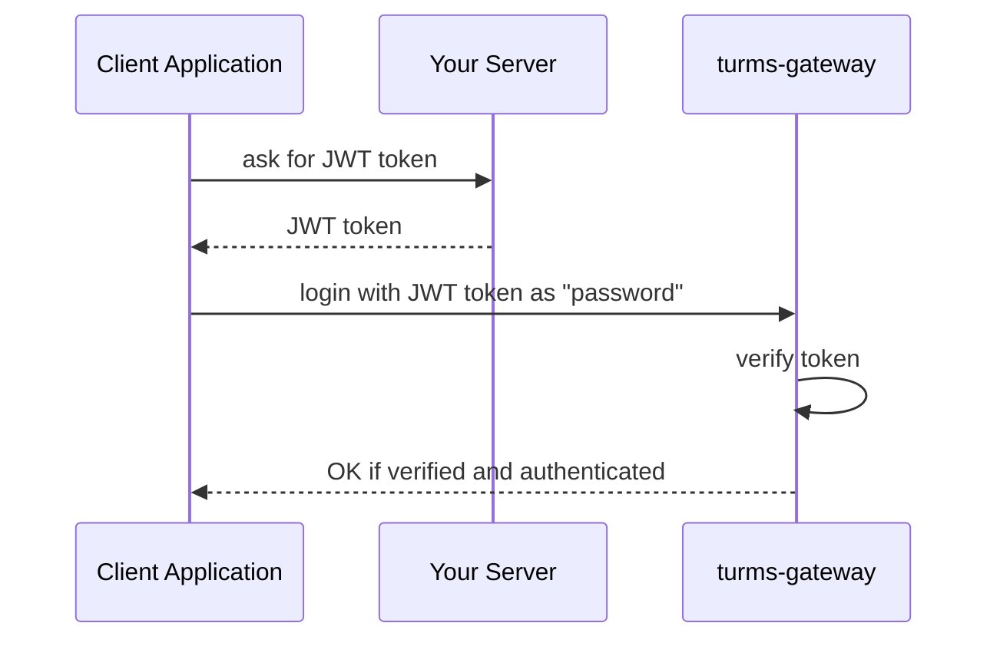
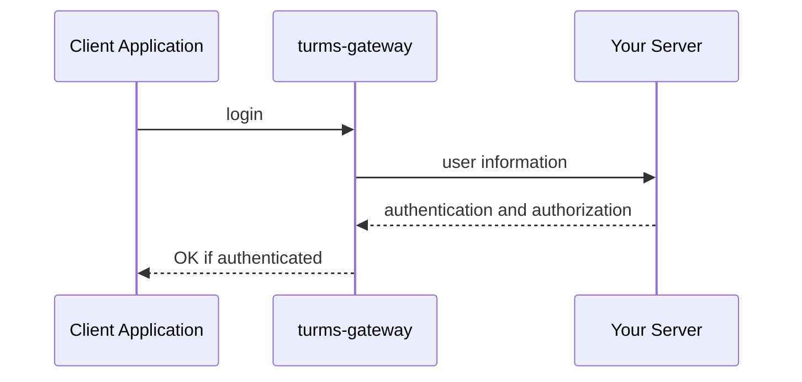
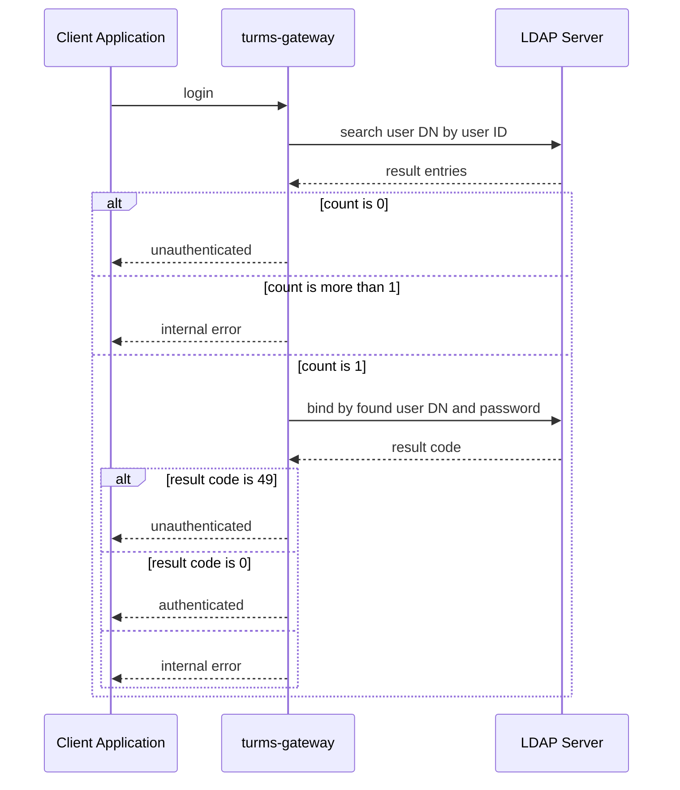

# 身份与访问管理

## 登陆的认证与授权

Turms既提供了内置的身份与访问管理机制，也支持用户基于插件自定义身份与访问管理实现。

### 相关配置

| 配置名                                                   | 默认值   | 说明                                                         |
| -------------------------------------------------------- | -------- | ------------------------------------------------------------ |
| turms.gateway.session.identity-access-management.enabled | true     | 是否开启身份与访问管理机制。<br />如果该值为`false`，则关闭Turms内置的身份与访问管理机制与用户基于插件自定义身份与访问管理实现，并允许任意用户登陆，与授权其发送任意请求类型 |
| turms.gateway.session.identity-access-management.type    | password | 使用的Turms内置身份与访问管理机制类型，其类型可以为`noop`、`password`、`jwt`、`http`与`ldap`。具体见下文 |

### 内置的身份与访问管理机制

#### 托管与非托管身份与访问管理机制

关于用户身份的认证与授权，有两个常见的、最基本的需求：

* 需要Turms服务能够自行托管用户数据，以免去Turms用户需要自行托管产品用户数据。

  满足这类需求的机制叫做`托管身份与访问管理机制`，具体对应着`password`机制。只有使用这类机制时，Turms服务端才会托管存储用户的基本信息，如用户ID与登陆密码，并将这些数据存储在MongoDB的`user`集合中。

* 需要Turms服务在不托管用户数据的同时，还能执行用户身份的认证与授权操作，这样Turms用户就不需要费时费力地将产品用户数据同步到Turms服务托管的数据库中。

  满足这类需求的机制叫做`非托管身份与访问管理机制`，具体对应着`jwt`、`http`与`ldap`机制。

但不管您使用任意机制，Turms服务端始终会基于用户ID，来托管与存储诸如用户关系（Relationship）、群成员（Group Member）等与用户相关的数据。

另外，由于在实际应用中，用户的认证与授权的实现组合非常多，Turms不可能、也没必要一次性把它们全都实现了，因此如果您有相关需求是Turms尚未实现的，可以在GitHub Issue区提出，我们会根据优先级排期实现。

#### 授权判断取消

因为非托管身份与访问管理机制不需要Turms服务端存储用户信息，因此turms-service无法根据用户信息来执行一些授权判断操作。

具体而言，当turms-service根据集群配置，检测到了当前集群采用的是非托管身份与访问管理机制时，有且仅有以下授权判断操作会被取消：

* turms-service服务端允许用户通过配置`turms.service.message.check-if-target-active-and-not-deleted`来启动或关闭`允许向陌生人发送消息`功能。

  如果配置为允许向陌生人发送消息，则turms-service服务端还会根据配置`turms.service.message.check-if-target-active-and-not-deleted`来决定是否要判断消息的接收用户是否存在。当采用非托管身份与访问管理机制时，该配置会被无视，turms-service不会校验消息的接收用户是否存在。

#### 1. NOOP

关闭内置的身份与访问管理机制，并允许任意用户登陆，与授权其发送任意请求类型。

##### 相关配置项

* turms.gateway.session.identity-access-management.type=noop

#### 2. 基于密码认证

基于Turms服务端自建的MongoDB中的`user`集合中的密码做用户认证。暂不支持授权实现。

##### 相关配置项

* turms.gateway.session.identity-access-management.type=password

#### 3. 基于JWT认证

JWT令牌中包含了该用户的认证与授权信息。

##### 工作流程



* 客户端应用向您的服务端申请JWT令牌
* 客户端应用拿到JWT令牌后，通过Turms客户端登陆接口`turmsClient.userService.login`中的`password`字段将JWT字符串发送给turms-gateway服务端
* turms-gateway服务端拿到JWT令牌后，根据JWT令牌中指定的算法与开发者在turms-gateway服务端配置的公钥配置（非对称加密算法：RS256、RS384、RS512、PS256、PS384、PS512、ES256、ES384、ES512）或私钥配置（对称加密算法：HS256、HS384、HS512）对JWT令牌进行校验。
* 如果开发者未在turms-gateway服务端配置JWT指定的算法密钥配置，则向客户端返回对应的错误信息，以告知客户端该算法不被支持
* 如果JWT令牌校验通过，则根据JWT令牌的认证与授权信息对用户进行认证与授权
* 如果JWT令牌校验失败，则向客户端返回对应的错误信息

##### JWT正文（Payload）格式

```json
{
    "iss": string, // issuer
    "sub": string, // subject
    "aud": array<string>, // audience
    "exp": number, // expiration time
    "nbf", number, // not before

    "authenticated": true,
    "statements": [{
        "effect": "ALLOW", // or "DENY"
        "actions": "*", // a string of ["*", "CREATE", "DELETE", "UPDATE", "QUERY"], or an array that contains these strings
        "resources": "*" // a string of ["*", "USER", "GROUP_BLOCKED_USER", ...], or an array that contains these strings
    }]
}
```

其中：

* `iss`、`sub`、`aud`、`exp`与`nbf`这五个JWT公共声明可用于JWT校验，除`sub`声明必须存在外，其余四个声明均可以不存在，即不做声明相关的逻辑校验。

  * `iss`（issuer）：JWT的签发者，如`www.my-server.com`。可配合配置项`turms.gateway.session.identity-access-management.jwt.verification.issuer`做校验。

  * `sub`（subject）：JWT所签发给的用户，如`123456789`。该字段必须与用户的登陆用户ID相同。

  * `aud`（audience）: JWT的接收方，如`www.my-turms.com`。可配合配置项`turms.gateway.session.identity-access-management.jwt.verification.audience`做校验。

  * `exp`（expiration time）：JWT的过期时间，如`1600000000`。在该时间之后，该JWT是无效的。

  * `nbf`（not before）：在该时间之前，该JWT是无效的，如`1600000000`。

* `authenticated`：私有布尔声明，表示该用户是否通过认证，为`true`（注意：该`true`既可以是布尔值，也可以是字符串）时则表示通过认证，反之则没通过。

* `statements`：私有数组声明，表示该用户拥有的权限，数组长度最大为100。

  * `effect`字段可以是`ALLOW`表示“允许的权限”，或`DENY`表示“禁止的权限”。被`DENY`禁止的权限生效优先级始终高于被`ALLOW`允许的权限，而不会受`statements`申明顺序的影响。

    `DENY`通常配合`ALLOW`一起使用，如权限“除了CREATE USER与GROUP_BLOCKED_USER资源的权限被禁止，其他权限都被允许”：

    ```json
    [{
        "effect": "DENY",
        "actions": "CREATE",
        "resources": ["USER", "GROUP_BLOCKED_USER"]
    }，{
        "effect": "ALLOW",
        "actions": "*",
        "resources": "*"
    }]
    ```

  * `actions`字段表示授权的行为，其值既可以是下述字符串，也可以是包含下述字符串的数组，如`["CREATE", "DELETE"]`：

    * `*`：所有行为
    * `CREATE`：创建行为
    * `DELETE`：删除行为
    * `UPDATE`：更新行为
    * `QUERY`：查询行为

  * `resources`字段表示授权的资源（即该用户是否有权限发送这些资源相关的请求），其值既可以是下述字符串，也可以是包含下述字符串的数组，如`["USER", "MESSAGE"]`：

    * `*`：所有资源
    * `USER`：用户数据相关资源
    * `USER_LOCATION`：用户位置相关资源
    * `USER_ONLINE_STATUS`：用户在线状态相关资源
    * `USER_PROFILE`：用户个人信息相关资源
    * `NEARBY_USER`：附近的用户相关资源
    * `RELATIONSHIP`：用户关系相关资源
    * `RELATIONSHIP_GROUP`：用户关系组相关资源
    * `FRIEND_REQUEST`：好友请求相关资源
    * `GROUP`：群信息相关资源
    * `GROUP_BLOCKED_USER`：群封禁用户相关资源
    * `GROUP_INVITATION`：群邀请相关资源
    * `GROUP_JOIN_QUESTION`：进群问题相关资源
    * `GROUP_JOIN_QUESTION_ANSWER`：进群问题答案相关资源
    * `GROUP_JOIN_REQUEST`：进群请求相关资源
    * `GROUP_MEMBER`：群成员相关资源
    * `JOINED_GROUP`：已加入的群相关资源
    * `MESSAGE`：消息相关资源
    * `CONVERSATION`：会话相关资源
    * `TYPING_STATUS`：输入状态相关资源
    * `RESOURCE`：存储资源相关资源

##### 相关配置项

| 配置名                                                       | 默认值                    | 说明                                                         |
| ------------------------------------------------------------ | ------------------------- | ------------------------------------------------------------ |
| turms.gateway.session.identity-access-management.type        | password                  | 设置为`jwt`以开启基于JWT的身份与访问管理机制                 |
| turms.gateway.session.identity-access-management.jwt.verification.issuer |                           | 该值不为空时，校验JWT的签发者是否等同于该值                  |
| turms.gateway.session.identity-access-management.jwt.verification.audience |                           | 该值不为空时，校验JWT的接收方是否包含该值                    |
| turms.gateway.session.identity-access-management.jwt.verification.custom-payload-claims |                           | 该值不为空时，校验JWT中的私有声明是否与该值匹配              |
| turms.gateway.session.identity-access-management.jwt.authentication.expectation.custom-payload-claims | { "authenticated": true } | 在JWT的私有声明中匹配该值，如果匹配成功，则表明该用户已被认证 |
| turms.gateway.session.identity-access-management.jwt.algorithm.hmac256.file-path |                           | 密钥文件路径。开发者只用配置该密钥或下文的P12中的一组        |
| turms.gateway.session.identity-access-management.jwt.algorithm.hmac256.p12.file-path |                           | PKCS#12文件路径                                              |
| turms.gateway.session.identity-access-management.jwt.algorithm.hmac256.p12.password |                           | PKCS#12密钥                                                  |
| turms.gateway.session.identity-access-management.jwt.algorithm.hmac256.p12.key-alias |                           | 密钥别名                                                     |
| turms.gateway.session.identity-access-management.jwt.algorithm.hmac256.p12.key-password |                           | 密钥密码。为空时，默认等同于PKCS#12密钥                      |
| turms.gateway.session.identity-access-management.jwt.algorithm.rsa256.pem-file-path |                           | PEM文件路径。开发者只用配置该PEM或下文的P12中的一组          |
| turms.gateway.session.identity-access-management.jwt.algorithm.rsa256.p12.file-path |                           | PKCS#12文件路径                                              |
| turms.gateway.session.identity-access-management.jwt.algorithm.rsa256.p12.password |                           | PKCS#12密钥                                                  |
| turms.gateway.session.identity-access-management.jwt.algorithm.rsa256.p12.key-alias |                           | 公钥别名                                                     |
| rsa384/rsa512/ps256/ps384/ps512/ecdsa256/ecdsa384/ecdsa512的配置与上述的`rsa256`一样 |                           |                                                              |

#### 4. 基于外部HTTP响应的身份与访问管理机制

HTTP响应中包含了该用户的认证与授权信息。

##### 工作流程



* 客户端通过Turms客户端登陆接口`turmsClient.userService.login`向turms-gateway服务端发送登陆请求

* turms-gateway服务端会向您的HTTP服务端发送HTTP请求，且请求正文格式为：

  ```json
  {
      "version": 1,
      "userId": number,
      "password": string,
      "loggingInDeviceType": string,
      "deviceDetails": object,
      "userStatus": string,
      "location": string,
      "ip": string
  }
  ```

* 您的HTTP服务端按照下文的“HTTP响应格式”返回该用户的认证与授权信息

* turms-gateway根据该HTTP响应对用户进行认证与授权

##### HTTP响应格式

```json
{
    "authenticated": true,
    "statements": [{
        "effect": "ALLOW", // or "DENY"
        "actions": "*", // a string of ["*", "CREATE", "DELETE", "UPDATE", "QUERY"], or an array that contains these strings
        "resources": "*" // a string of ["*", "USER", "GROUP_BLOCKED_USER", ...], or an array that contains these strings
    }]
}
```

`authenticated`与`statements`两个字段的含义与上文JWT正文中对应声明的含义相同，故不赘述。

##### 相关配置项

| 配置名                                                       | 默认值                    | 说明                                                         |
| ------------------------------------------------------------ | ------------------------- | ------------------------------------------------------------ |
| turms.gateway.session.identity-access-management.type        | password                  | 设置为`http`以开启基于外部HTTP响应的身份与访问管理机制       |
| turms.gateway.session.identity-access-management.http.request.url | ""                        | 请求URL                                                      |
| turms.gateway.session.identity-access-management.http.request.headers | true                      | 附加的请求头                                                 |
| turms.gateway.session.identity-access-management.http.request.http-method | GET                       | 请求方法                                                     |
| turms.gateway.session.identity-access-management.http.request.timeout-millis | 30000                     | 请求超时时长                                                 |
| turms.gateway.session.identity-access-management.http.authentication.response-expectation.status-codes | "2??"                     | 在响应状态码中匹配该值，如果匹配成功，则继续进行其他匹配，否则认证失败 |
| turms.gateway.session.identity-access-management.http.authentication.response-expectation.headers |                           | 在响应头中匹配该值，如果匹配成功，则继续进行其他匹配，否则认证失败 |
| turms.gateway.session.identity-access-management.http.authentication.response-expectation.body-fields | { "authenticated": true } | 在响应正文中匹配该值，如果匹配成功，则继续进行其他匹配，否则认证失败 |

#### 5. 基于LDAP认证

##### 工作流程



1. 客户端通过Turms客户端登陆接口`turmsClient.userService.login`向turms-gateway服务端发送登陆请求。

2. turms-gateway获取到客户端发来的登陆请求参数后，会使用登陆请求中的`userId`参数，与turms-gateway系统中配置的参数（如下文将会提到的`baseDn`与`searchFilter`），去构造LDAP中的search请求，以查询`userId`对应的用户DN。

3. 当turms-gateway获取到LDAP响应的search结果时，turms-gateway会校验search结果的entries数量：

   1. 如果数量为0，则说明账号不存在，因此响应客户端未授权；
   2. 如果数量为1，则说明用户登陆请求中的`userId`匹配到了对应的DN。turms-gateway会使用该用户DN与用户登陆请求中的`password`参数，向LDAP服务端发送bind登陆操作：
      1. 如果结果码（result code）为49（无效凭证），则响应客户端未授权。
      2. 如果状态码为0（登陆成功0，则响应客户端已授权。
      3. 如果为其他状态码，则响应客户端系统内部异常。
   3. 如果数量大于1，则说明系统配置的`searchFilter`参数异常，需要重新配置，因此响应系统内部异常。

   **注意：一个LDAP用户的Turms用户ID值是由LDAP系统管理员配置的，并不是由Turms服务端配置的，且要求该值必须大于0，无其他条件限制。**

##### 相关配置项

| 配置名                                                       | 默认值          | 说明                                                         |
| ------------------------------------------------------------ | --------------- | ------------------------------------------------------------ |
| turms.gateway.session.identity-access-management.type        | password        | 设置为`ldap`以开启基于LDAP的身份与访问管理机制               |
| turms.gateway.session.identity-access-management.ldap.base-dn | ""              | 基准目录。如`dc=turms,dc=im`                                 |
| turms.gateway.session.identity-access-management.ldap.admin.host | localhost       | 用于管理员相关操作的LDAP服务端地址                           |
| turms.gateway.session.identity-access-management.ldap.admin.port | 389             | 用于管理员相关操作的LDAP服务端端口号                         |
| turms.gateway.session.identity-access-management.ldap.admin.ssl.... |                 | 用于管理员相关操作的LDAP的SSL相关配置                        |
| turms.gateway.session.identity-access-management.ldap.admin.username | ""              | 管理员用户名                                                 |
| turms.gateway.session.identity-access-management.ldap.admin.password | ""              | 管理员密码                                                   |
| turms.gateway.session.identity-access-management.ldap.user.host | localhost       | 用于用户相关操作的LDAP服务端地址                             |
| turms.gateway.session.identity-access-management.ldap.user.port | 389             | 用于用户相关操作的LDAP服务端端口号                           |
| turms.gateway.session.identity-access-management.ldap.user.ssl.... |                 | 用于用户相关操作的LDAP的SSL相关配置                          |
| turms.gateway.session.identity-access-management.ldap.user.search-filter | "uid=${userId}" | 搜索过滤条件。turms-gateway根据该搜索语句去LDAP系统中匹配对应的用户DN。<br />`${userId}`是用户ID占位符，在条件被使用时，会被替换成用户登陆请求中的`userId`。 |

**提醒：配置中提到的`管理员`其实并不一定要是LDAP系统的管理员，只要被指定的LDAP用户拥有search查询系统中条目的权限即可。**

### 基于插件的自定义身份与访问管理实现

认证插件接口：`im.turms.gateway.infra.plugin.extension.UserAuthenticator`

授权插件接口：TODO

读者可以参考[插件实现](https://turms-im.github.io/docs/zh-CN/server/development/plugin#%E6%8F%92%E4%BB%B6%E5%AE%9E%E7%8E%B0)，实现上述插件接口。

## 业务逻辑的认证与授权

对于客户端发来的权限信息，Turms服务端的态度是“客户端传来的权限信息均不可信”，因此Turms服务端会根据您在Turms服务端处所设定的业务配置，自行做各种必要的权限判断。

以“修改已发送消息”功能为例，该行为会触发一系列判定逻辑。Turms会先判断目标消息是否确实是由该用户发出的，再根据您在Turms服务端配置的`allowEditMessageBySender`（默认为true），来判断是否允许用户修改已发送消息，若您设置其为false，则在客户端处会捕获到一个`ResponseException`（Kotlin）或`ResponseError`（JavaScript/Swift）对象，而它由业务状态码模型`ResponseStatusCode`表示（由`code`与`reason`描述信息组成）。

再比如对于一个“简单”的“发送消息”请求，Turms服务端就会判断该消息发送用户是否处于激活状态、是否设置了“允许发送消息给陌生人（非关系人）”、消息发送者是否在黑名单中。如果接收方是群组，那么消息发送者是否是群成员，并且是否处于禁言状态等等逻辑判断。而您仅仅只需调用一个`sendMessage(...)`接口即可。